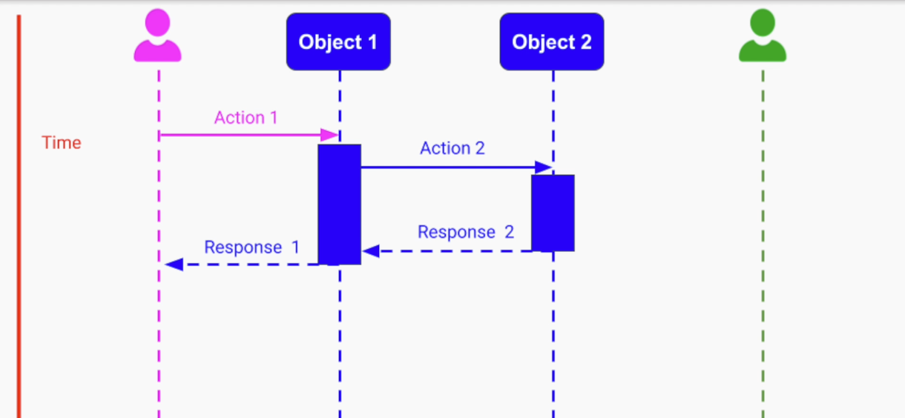
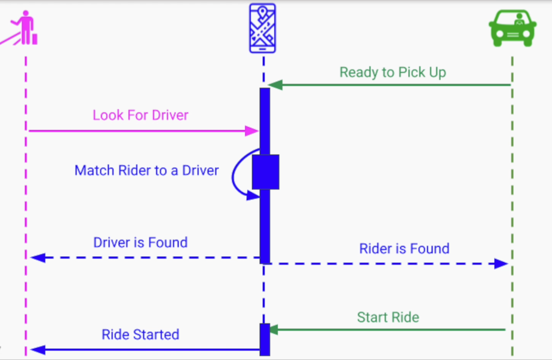
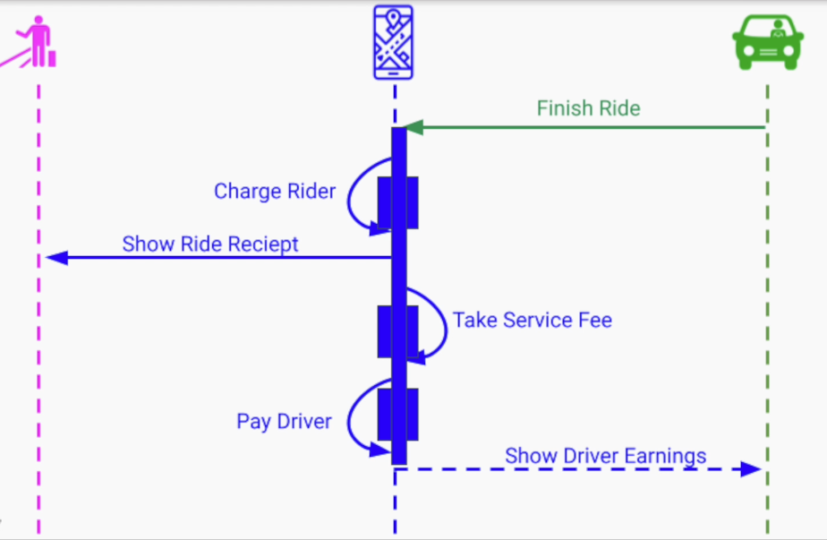

# Section 2: System Requirements & Architectural Drivers

[Introduction to System Design & Architectural Drivers](#introduction-to-system-design--architectural-drivers)

[Feature Requirements - Step by Step Process](#feature-requirements---step-by-step-process)

[System Quality Attributes Requirements](#system-quality-attributes-requirements)

[System Constraints](#system-constraints)

---

## Introduction to System Design & Architectural Drivers

> The requirements of a system is the formal description of what we need to build

Large scale system requirements are different than the usual requirements 
we typically get for implementing
- A method
- An algorithm
- A class

---

### Big Scope and High Level of Abstraction

Method / function -> Class -> Module -> Library -> Application

The range of possible ways to solve the problem is getting bigger -> More degrees of freedom

<b>Examples of Scope and Abstraction</b>

- File Storage System
- Video Streaming Solution
- Ride Sharing Service

---

### High Level of Ambiguity

- System Design has high level of ambiguity
- Two reasons
  - The person providing the requirements is often not an engineer and may even be not very technical
  - Getting the requirements is part of the solution
    - The client doesn't always know what they need
    - The clinet generally knows only what problem they need solved
   
<b>Example - Hitchhiking Service</b>

High Level Requirement: "Allow people to join drivers on a route, who are willing to take passengers for a fee"

Clarifying Questions:

- Real Time vs Advance Reservation
- User Experience - Mobile? Desktop? Both?
- Payment through us or direct payment?

---

### Importance of Gathering Requirements

- What happens if we don't get the requirements right?
- We can simply build something and then fix it
- Seemingly there's no cost of materials in software so changes should be cheap??

<b>Large scale systems are big projects that cannot be easily changed</b>
- Many enginners are involved
- Many months of engineering work
- Hardware and Software costs
- Contracts include financial obligations
- Reputation and brand

---

### Types of Requirements

- <b>Features of the System</b>
  - Functional requirements
- <b>Quality Attributes</b>
  - Non-Functional requirements
- <b>System Constraints</b>
  - Limitations and boundaries

---

### Features / Functional Requirements

- Describe the system behavior - what "the system must do"
- Easily tied to the objective of our system

Describe the system as a "black box" function

User Actions, Events --> System --> Result / Outcome

- Functional Requirements do not determine its architecture
- Generally, any architecture can achieve any feature

<b>Examples</b>

_When a rider logs into the service mobile app, the system must display a map
with nearby drivers within 5 miles radius_

- Input: a rider logs into the service mobile app
- Output: display a map with nearby drivers within 5 miles radius

_When a rider is completed, the system will charge the rider's credit card and credit the driver,
minus service fees_

- Input event: completion of the ride
- Outcome of the operation: transfer of the money

---

### Quality Attributes / Non-Functional Requirements

- System properties that "the system must have"

<b>Examples</b>
- Scalability
- Availability
- Reliability
- Security
- Performance

- The quality attributes <b>dictate the software architecture of our system</b>

The software architecture defines the system quality attributes, and different architectures 
provide us with different quality attributes

---

### System Constraints

<b>Examples</b>
- Time Contraints - Strict deadlines
- Financial Constraints - Limited budget
- Staffing Constraints - Small number of available engineers

the 3 types of requirements are also referred to as <b>Architectural Drivers</b>

---

### Summary

- Importance of system requirements
- Challenges
  - Hish Scope and Abstraction
  - Ambiguity
- Risks of not getting the requirements correctly up front
- Requirements classification / Architectural drivers:
  - Features - Function requirements
  - Quality Attributes - Non-functional requirements
  - Constraints - Limitations and boundaries
 
---

## Feature Requirements - Step by Step Process

- Formal Method of Gathering Functional Requirements
- Example with a Sequence Diagram

### Gathering Requirements
  - Importance: Risks
  - Challenges: Ambiguity & Scope

<b>Requirement Gathering - Naive Way</b>

- Ask the client to describe everything they need
- For complex systems - Not a good approach

<b>Methods of Gathering Requirements</b>

- More powerful method of gathering requirements
  - Use Cases
    - Situation / Scenario in which our system is used
  - User Flows
    - A Step By Step / Graphical representation of each use case

---

### Requirement Gathering Steps

1. Identify all the actors /users in our system
2. Capture and describe all the possible use-cases / scenarios
3. User Flow - Expand each use case through flow of events

Each event contains
- Action
- Data

<b>Example: Hitchhiking Service </b>

"Allow people to join drivers on a route, who are willing to take passengers for a fee"

**Actors**

- Driver
- Rider

**Rider Use Cases**

- Rider first time registration
- Driver registration
- Rider login
- Driver login
- Successful match and ride
- Unsuccessful ride

---

### Unified Modeling Language - Sequence Diagram

**Sequence Diagram**: Diagram that represents interactions between actors and objects

Part of the **Unified Modeling Language (UML)**: Standard for visualizing system design

In practice
  - UML diagrams are used mostly for sofware design
  - No real standard diagrams representing software architecture in the industry
  - UML is not strcitly followed in the industry
  - Sequence Diagrams are frequently used to represent interactions between entities

### Unified Modeling Language: Sequence Diagram

### User Flow for Ride Initialization

Data is not represented in this diagram

### User Flow for Ride Completion

---

### Summary

- Learned a formal way to capture the features and functional requirements
- The three steps process
  - Identifying all the users and actors
  - Gathering all the use cases
  - Expanding each use case with a flow of interactions between the actors in our system
- Sequence diagram - a visual way that documents the interactions between actors and different components of our system

---

## System Quality Attributes Requirements

a.k.a Non-Functional Requirements

### Quality Attributes Motivation and Definition 

### Motivation

- Systems are frequently redesigned NOT because of functional requirements
- But because the system as it stands
  - Isn't **fast** enough
  - Doesn't **scale**
  - Slow to **develop**
  - Hard to **maintain**
  - Not **secure** enough

---

### Definition

- Quality attributes are non functional requirements
- They describe
  - The **qualities** of the **functional** requirements
  - The overall **properties** of the **system**
- Provide a **quality measure** on how well our system performs on a **particular dimension**
- They have direct correlation with the architecture of our system

---

### The Quality Attribute Example - Online Store 1

_when a user clicks on a search button after they typed in a particular search keywords,
the user will be provided with a list of products that closely match the search
keyword within at most a 100 milliseconds_

Functional Requirement: The action that user takes

Quality Attribute: Performance

### The Quality Attribute Example - Online Store 2

_The online store must be available to the users at least 99.9% of time_

Quality Attribute: Availability

### The Quality Attribute Example - Online Store 3

_Development team can deploy a new version of the online store at least twice a week_

Quality Attribute: Deployability

---

### Quality Attributes Considerations

**1. Testability and Measurability**

- Quality attributes need to be
  - **Measurable**
  - **Testable**
- If we cannot prove that our system satisfied the required quality attributes we don't know if our system performs well or poorly

**Unmeasurable Quality Attribute - Example**

_When a user clicks on the buy button, the purchase confirmation must be displayed **quickly**(???) to the user_

**2. Tradeoffs**

- No single software architecture can provide all the quality attributes
- Certain quality attributes contradict one another
- Some combinations of quality attributes are very hard / impossible to achieve
- We (Software Architects) need to make the right **tradeoff**

**Trade Off - Login Page Example**

1. Performance - Login Time < 1 second
   - Faster

3. Security - Username, Password, SSL
   - Slower

**3. Feasibility**

- We need to make sure that the system is capable of delivering with the client asking for
- The client may ask for something that is either
  - Technically impossible
  - Prohibitively expensive to implement

**Feasibility Examples - Unrealistically low latency**

Client ➡️ Data Center: 100 - 150ms

Cannot guarantee page loads to be less than 100ms, not even close because HTTP requires multiple round trips
as multiple assets

**Feasibility Examples - 100% Availability**

- Our system can never fail
- We never have a chance to take our system down for
  - Maintenance
  - Upgrade

**Feasibility Examples**

- Full protection against hackers
- High resolution video streaming in limited bandwidth areas
- Very high storage growth

## Summary

- Motivation for quality attributes
- Quality attribute definition: "Quality measure on how well our system performs on a particular dimension"
- 3 important considerations
  - Testability and Measurability
  - Trade offs
  - Feasibility

---

## System Constraints

### Introduction

- Once we define what our system must do, we have freedom on how to structure our system
- While defining the final architecure, we have to make a lot of decisions
- For _quality attributes_, we are expected to make trade-offs

> A system contraint is essentially a decision that was already either fully or partially made for us,
> restricting our degrees of freedom

- Instead of looking a constraint as a choice that was taken away, we look at it as a decision that was already made
- System Constraints are referred as pillars for software architecture because
  - They provide us with a solid strating point
  - The rest of the system need to be designed around them 

---

### Types of Constraints 

There are three types of constraints

**Technical constraints**

- Being locked to a particular **hardware/cloud vendor**
- Having to use a particular **programming language**
- Having to use a particular **database or technology**
- Having to support certain **platforms, browsers, or OS**
- Technical constraints may seem like they belong to implementation and not to software architecture
- In practice, they affect the decisions we make in the design phase and put restrictions on our architecture

**Examples**

- If our company makes a decision to run on-premise data centers then
  - All the cloud architectures and paradigms will become unavailable to us
  - We would have to implement a lot of non-trivial infrastructure
- If we have to support older browsers or low-end mobile devices then
  - We have to adapt our architecture to support those platforms and their APIs
  - Keep providing a different, more high-end experience for newer browsers or higher-end devices

---

**Business Constraints**

- As engineers, we make the right decisions and architectural choices from a technical perspective
- This forces us to make sacrifices in
  - Architecture
  - Implementation

**Examples**

- Limited budget or a strict deadline will make us have very different choices than if we had an unlimited budget and unlimited time
  - Different software architectural patterns are based on suitability between small startups or bigger organizations
- Usage of third-party services with their own APIs and architectural paradigms as part of our architecture
  - Using third-party shipping/billing providers for an online store
  - Integration of different banks/brokers/security/fraud detection services for an investing platform

---

**Regulatory/legal constraints**

- Global 
- Specific to a region

**Examples**

- In the US, **HIPPA** (Health Insurance Portability and Accountability Act) places constraints on accessing patients' data
- In the European Union, **GDPR** (General Data Protection Regulation) sets limitations on collecting, storing and sharing users' data

---

### Considerations

**1. Accepting Constraint Lightly**

- We shouldn't take any given constraint lightly
  - There should be a distinction between
    - Real constraints
    - Self-imposed constraints
   

**Examples**

- External rules and regulations may not have room to negotiate
- Internal constraints can be negotiated
- If locked to using a particular
  - Hardware
  - Cloud vendor
  - Technologies
- May be an opportunity to explore other options

---

**2. Use loosely coupled architecture**

**Examples**

- if limited to a database/third-party service, we need to make sure our system is not tightly coupled to that technology or APIs
- Usage of different technology/service in future should need minimal changes
- Different parts of the system can be decoupled to be easily replaced or updated independently

---

### Summary

- The 3rd type of architectural driver, the _System Contraints_
- _Decision that was already either fully or partially made for use, restricting our degrees of freedom_
- Three types
  - Technical Constraints
  - Business Constraints
  - The legal constraints
- Considerations
  - Not Taking Constraints Lightly
  - Use Loosely Coupled Architecture

---

