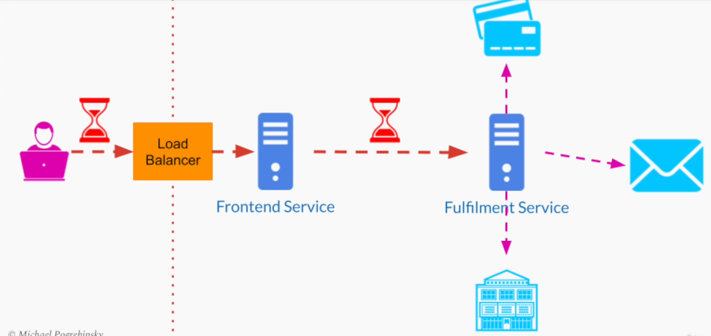
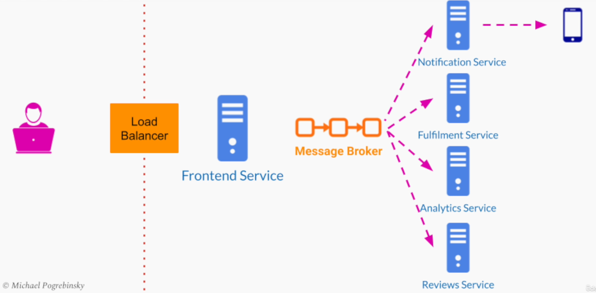

# Section 5: Large Scale Systems Architectural Building Blocks

- [Load Balancer](#load-balancer)
- [Message Brokers](#message-brokers)
- [API Gateway](#api-gateway)

---

## Load Balancer

Role of Load Balancer: **Balance load among a group of servers**

Without a load balancer, the client application will have to know the addresses of the multiple servers, this **tighty couples** the client application to our systems
internal implementation

Added feature: Most balancing solutions also provide an abstraction between the client application and our group of servers. **Single Server Abstraction**

---

## Quality Attributes

**1. Scalability - Auto-scaling**

- In a cloud environment, we can use auto-scaling policies to intelligently add/remove servers based on
  - Requests per second
  - Network bandwidth
 
**2. High Availability**

- Can stop sending traffic to servers, that cannot be reached

**3. Performance (Throughput)**

- When it comes to performance, load balancers may add a little _latency_
- It is an acceptable price to pay for _increased performance_ in terms of throughput

**4. Maintainability**

- we can have a rolling release while still keeping our SLA in terms of availability

---

## Types of Load balancers

### DNS load balancing

- DNS is part of the internet infrastructure that maps human-friendly URLs to IP addresses
  - They can be used by network routers to route requests to individual computers on the web
  - DNS is the "phone book of the internet"
- http://my-online-store.com ➡️ DNS ➡️ IP ➡️ Server Request: 123.53.0.1
- A single DNS record doesn't have to map to a single IP address
  - can be easily configured to return a list of IP addresses
    - 123.53.0.1
    - 123.53.0.2
    - 123.53.0.3
  - DNS returns those IP addresses with different order
  - This way the **Domain Naming System balances the load on our servers by simply rotating this list** in a Round Robin fashion

**Advantages**

- Simple
- Cheap (Comes for free by purchasing a domain name)

**Drawbacks**

- DNS doesn't monitor the health of our servers
  - The list of IP addresses changes based on the TTL configured for that particular DNS record
  - This list of addresses can be cached in different locations such as the client's computer
- The balancing strategy is always just a simple round-robin
  - Some of our applications instances may be running on more powerful servers than others
  - One of our servers may be more overloaded than the other
- The client application gets the direct IP addresses of all our servers
  - This exposes some implementation details of our system
  - It makes our system less secure
  - A malicious client application can pick one IP address and send requests only to that particular server
  - This would overload it more than other servers

---

### Hardware & Software Load Balancers

- Hardware Load Balancers
  - Run on **dedicated devices** designed and optimized specifically for load balancing
- Software Load Balancers
  - **Programs** that can run on a general-purpose computer and perform a load balancing function
- All the communication between the client and the group of servers is done through the load balancer
  - individual IP addresses as well as the number of servers we have behind the load balancer are not exposed to the  users
  - makes our system more secure
- Can actively monitor the health of our servers and send them periodic health checks
  - actively detect if one of our servers became unresponsive

**Software / Hardware Load Balancing Strategies**

- Hardware and Software Load Balancers can balance the load **intelligently** taking into account
  - Different types of hardware
  - Current load on each server
  - Number of open connections

**Software / Hardware Load Balancing - Internal Use**

- SW and HW Load Balancers can be used inside our system
- They can create an abstraction between different services
  - we can scale each service completely independently

**Software / Hardware Load Balancers - Collocation**

They are usually co-located with the group of servers they balance the load on

- if we put the LB too far, we adding extra latency

**Software / Hardware Load Balancers - Multiple Data Centers**

Having only one LB for both groups of servers, will sacrifice the performance for at least one of those locations

**Load balancers - DNS Resolution**

- Load balancers on their own do not solve the DNS resolution problem
- We would still need some kind of DNS solution to map a human-readable domain name to an IP address

---

### Global Server Load Balancing

- GSLB is a hybrid between
  - DNS service
  - Hardware / Software Load Balancer

Can make more intelligent routing decisions. GSLB can figure out the user's location based on the origin IP inside the incoming request.

- has similar monitoring capabilities to a typical Hardware / Software Load Balancer
  - location of each server
  - health of each server

**GSLB - Traffic Routing**

- Most GSLB can be configured to route traffic based on a _variety of strategies_ and not just by physical location
- Since they are in constant communication with our data centers, they can be configured to route users based on
  - The currect traffic
  - CPU load in each data center
  - Best-estimated response time
  - Bandwidth between user and the data center

**Global Server Load Balancing - Disaster Recover**

If there is a natural disaster or a power outage in one of our data centers, the users can be easily routed to different locations
which provides us with higher availability

**GSLB - DNS Load Balancing**

To avoid a LB being a Single Point Of Failure, we can place multiple load balancers and register all the addresses with the GSLB DNS service

---

### Summary

- We learned about a very important software architecture building block, the **Load Balancer**
- We learned about four load balancing solutions, which are
  - DNS load balancing
  - Hardware load balancing
  - Software load balancing
  - Global Server Load Balancing
- We talked about the different _quality attributes_ that a load balancer provides to our system
- We saw how we can combine all those different solutions to architect a large-scale system that can
  - Provide _high performance_ and _high availability_
  - Scale to millions of users located in _different geographical locations_

---

## Message Brokers

### Synchronous Communication Drawbacks

Sender Application ➡️ Connection ➡️ Load Balancer ➡️ Connection ➡️ Receiver Application

- Both application instances have to remain healthy and maintain this connection to complete the transaction
  - It's easy to achieve this when two services exchange small messages that take short time to process and respond
  - It can get complex when a service takes a long time to complete its operation and provide a response 

- No padding in the system to absorb a sudden increase in traffic or load

---

### Message Broker

- A software architectural building block that uses the _queue data structure to store messages_ between senders and receivers
- A message broker is used _inside our system_ and not exposed externally

--

### Message Broker - Capabilities

- Basic capabilities
  - Storing / temporarily buffering the messages
  - Message routing
  - Transformation validation
  - Load balancing

---

### Loose Coupling Between Senders & Receivers

- Entirely _decouple_ senders from the receivers
- The fundamental building block of **asynchronous** software architecture

The client will receive an acknowledgement immediately after placing the order.

Later will get an email asynchronously with an official confirmation for purchasing the ticker.

We can break the ticket reservation service into multiple services, each for one stage in the transaction.

Frontend Service ➡️ Message Broker ➡️ Reservation Service ➡️ Message Broker ➡️ Billing Service ➡️ Message Broker ➡️ Email Service

---

### Online Store - Buffering

The important benefit that a message broker provides us with is buffering of messages to absorb traffic spikes

---

### Message Broker - Benefits

- Most message broker implementations offer the _publish / subscribe pattern_ where multiple services can
  - Publish messages to a particular channel
  - Subscribe to that channel
  - Get notified when a new event is published

---

### Online Store - Pub / Sub

---

### Fault Tolerance

- A message broker adds a lot to fault tolerance to our system
- It allows different services to communicate with each other while some of them may be unavailable temporarily
- Message brokers prevent messages from being lost

---

### Availability and Scalability

- The additional fault tolerance helps us provide high availability to our users
- A message broker can queue up messages when there is a traffic spike
- It allows our system to scale to high traffic

---

### Performance

- We pay a little in performance when it comes to latency
- A message broker adds significant indirection between two services
- This performance penalty is not too significant for most systems

---

### Summary

- We learned about a fundamental building block to any asynchronous software architecture - Message Broker
- We got the motivation for using a message broker
- We talked about different benefits and capabilities
  - Asynchronous architecture
  - Buffering
- We talked about the two main quality attributes
  - _High availability_
  - _Scalability_

---

## API Gateway

### Video Streaming and Sharing System Example

- Upload Videos
- Watch Videos
- Comment on Videos

**Intial: Video Streaming and Sharing Service**

- Serve Frontend: HTTP, JS
- User Profile Management
- Channel Subscriptions
- Notifications
- Video Storing and Streaming
- Users Comments
- Security

Too Complex!

**Stage 1: Splitting up Services**

- Frontend Service
- Users Service
- Video Service
- Comments Service

---

### Consequences of Splitting a Service

- The single API now split into _multiple_ APIs
- So now we need to
  - Update the frontend code to be aware of the internal organization of our system
  - Make calls to different services on the browser depending on the task

**Home Page Request**

User ➡️ Frontend Service + Users Service

**Watch a Movie Request**

User ➡️ Frontend Service + Video Service + Comments Service

Now, it's service needs to implement it's own security, authentication and authorization
- adds performance overhead
- duplication

---

### API Gateway

API Gateway is API management service, that seats in between the client and a collection of backend services.

- The API Gateway follows a software architecture pattern called _API composition_
- We compose all the APIs of all our services into one single API
- The client applications can call one single service

---

### API Gateway - Benefits

- Seamless internal modifications / Refactoring
  - e.g. spliting the Frontend Service
    - Desktop Frontend Service
    - Mobile Frontend Service
  - Video Splitting Service to
    - High Resolution Service
    - Low Resolution Service
- Consolidating all security, authorization, and authentication in a single place
  - Depending on the permissions and the role of the user, we can allow different operations such as
    - Viewing private videos
    - Deleting / uploading new videos
  - We can also implement _rate-limiting_ at the API Gateway to block Denial of Service (DoS) attacks from malicious users
- Request Routing
  - We save the overhead of authenticating every request from the user at each service by performing it in a single place
  - We can also save the user from making multiple requests to the different services
- Static content and response caching
- Monitoring and alerting
- Protocol Translation
  - e.g. Externally expose REST API JSON, internally can use gRPC / PROTO Buffer
  - Legacy service that support HTTP 1.0 REST API and represent their objects using XML
  - Third parties which have systems that support Thrift / SOAP and want to use our API protocol and formats

---

### API Gateway - Considerations

- API Gateway **shouldn't contain any business logic**
  - The main purpose of an API Gateway is
    - API composition
    - Routing requests to different services
  - **Anti Pattern**: Following the anti-pattern of adding business logic to our API Gateway will make it too smart
    - We may end up again with a single service that
      - Does all the work
      - Contains an unmanageable amount of code
    - This was the problem we wanted to solve initially by splitting our system into _multiple services_
- API Gateway may become a **Single Point of Failure**
  - We can solve
    - Scalability
    - Availability
    - Performance
    - by deploying multiple instances of API Gateway and placing them all behind a _load balancer_
  - Our entire system becoms unavailable of the client if
    - We push a bad release
    - Introduce a bug that may crush the API Gateway
  - Eliminate any possibility of human error
  - Deploy new releases to the API Gateway with caution
- Avoid bypassing API Gateway from external services

---

### Summary

- We learned about a important architectural building block and design pattern, the _API Gateway_
- We learned about the benefits of an API Gateway such as
  - _API composition_
  - _Security_
  - _Caching_
  - _Monitoring_
- We talked about considerations for correctly using an API Gateway which are
  - Keeping business logic out
  - Being careful in making modifications
  - Not breaking the abstraction by making all external API calls through API Gateway only
 
---
