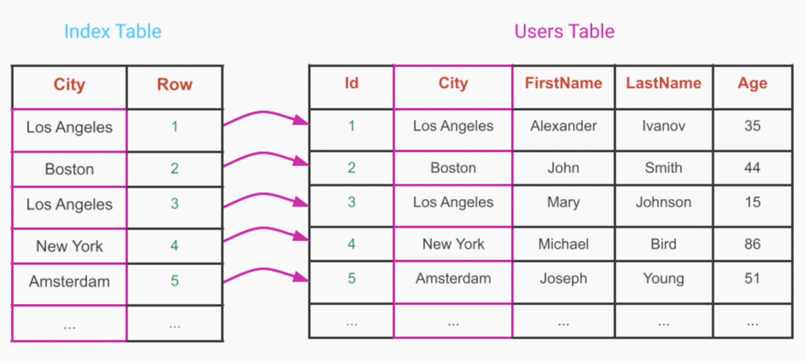
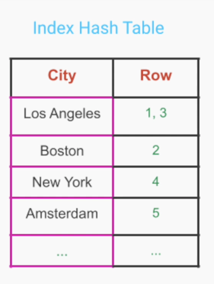
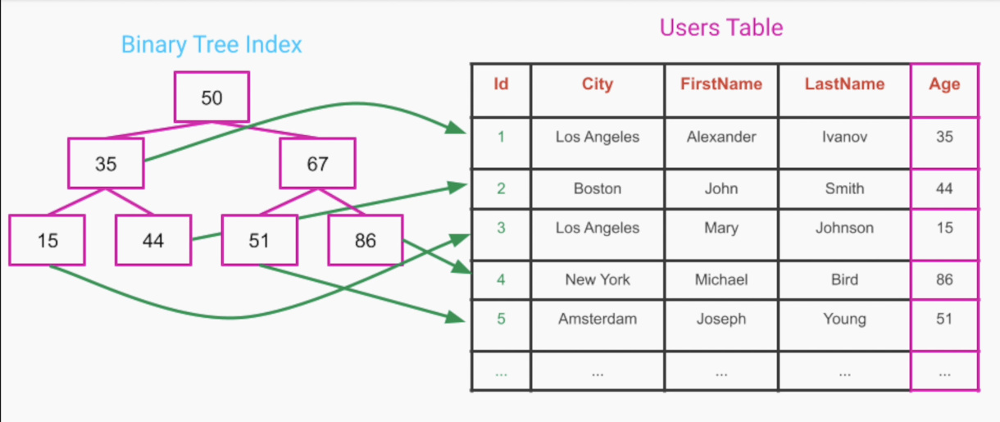
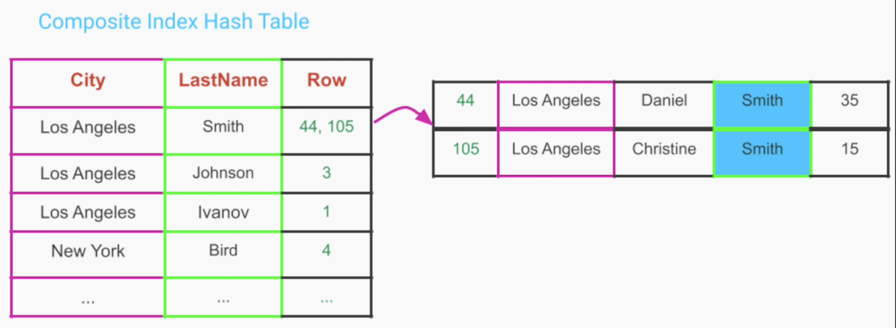
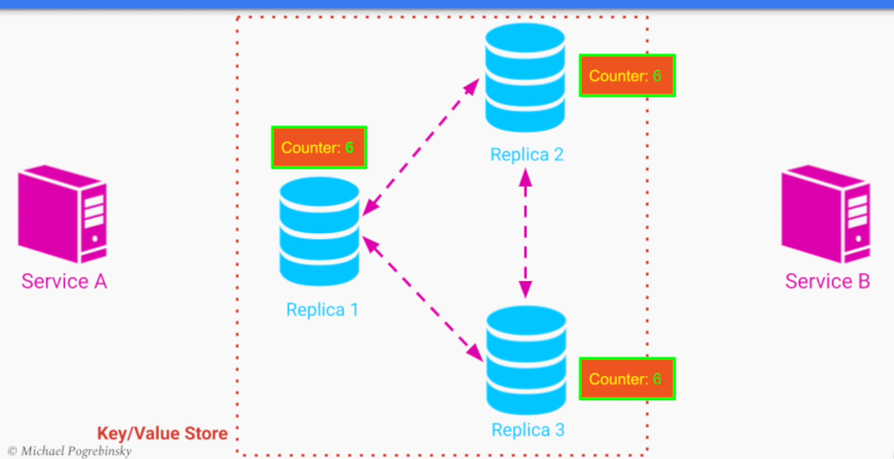
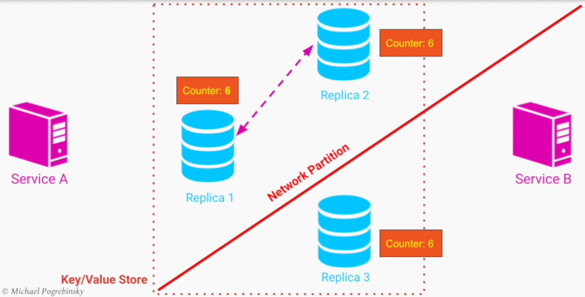

# Section 6: Data Storage at Global Scale

- [Relational Databases & ACID Transactions](#relational-databases--acid-transactions)
- [Non-Relational Databases](#non-relational-databases)
- [Techniques to Improve Performance, Availability & Scalability of Databases](#techniques-to-improve-performance-availability--scalability-of-databases)
- [Brewer's CAP Theorem](#brewers-cap-theorem)
- [Scalable Unstructured Data Storage](#scalable-unstructured-data-storage)

---

## Relational Databases & ACID Transactions

### Relational Databases - Table Structure

In a relational database, data is stored in tables. Each row in the record represents a single record, 
and all the records are related to each other through a predefined set of columns.

Each column in the table has a name, a type and optionally and set of constraints

Each record in the table is uniquely identified by a primary key, which can be represented by a column or a set of columns

---

### Relational Database - Schema

- The structure (schema) of each table is defined ahead of time
- This gives us the knowledge of what each record must have
- Because of this, we can use a robust query language to _analyze_ and _update_ the table data

---

### SQL - Structured Query Language

- The industry-standard scripting language to perform such queries is called SQL - _Structured Query Langage_
- Different relational database implementations have their own _additional features_ to their version of that language

---

### Relational Databases - History

- They're a very _well-known_ and _proven_ way of structing data since the 1970s
- Storing data in separate tables allows us to eliminate the need for _data duplication_
- Storage has become cheaper
- The amount of data companies collect is larger than before
- For large-scale systems, storage cost are still a major factor

**Online Store Example**

- As customers place orders for products, we need to store orders in a separate table
- We want the ability to easilly analyze and report on things like
  - Which products sell the most/least at a given time frame
  - Rank companies based on performance of their products
  - Get break down of which category of products does better during certain sales / seasons

--- 

### Relational Databases - Advantages

1. Ability to form complex and flexible queries
2. Efficient storage
3. Natural structure of data for humans
4. ACID transaction guarantees

---

### ACID Transactions

- **Atomicity**
- **Consistency**
- **Isolation**
- **Durability**

---

### Transaction - Definition

> A transaction is a sequence of operations that for an external observer should appear as a single operation

**Money Transfer Example**

- User A Balance = User A Balance - $100
- User B Balance = User B Balance + $100

Single Transaction

---

### ACID

**Atomicity**

- Each set of operations that are part of one transaction either
  - Appear _all at once_
  - Don't _appear at all_

**It's even all or nothing, and never anything in between**


**Consistency**

- A transaction that was _alread commited_ is seen by all **future** queries/ transactions
- A transaction doesn't violate any constraints that we set for our data

e.g. Impossible for a future query to see transfered funds either remaining / transfered in one of the accounts


**Isolation**

Related to _Atomicity_ in the context of **concurrent** operations performed on our database

Isolation guarantees that if there is another transaction happening simultaneously, that second concurrent transaction will not see
an intermediate state of the money being either present in both accounts or missing in both accounts

Those two transactions are isolated from each other, in such a way that they do not see each other's intermediate state


**Durability**

Once a transaction is complete, its _final state_ will **persist** and remain permanently inside the database


---


### Relational Databases - Disadvantages

**1. Rigid structure enforced by table's schema**

- The schema has to be _defined ahead of time_ before we can use the table
- If we want to change the schema of a table by adding/removing a column, we would have some _maintenance time_
- We need to plan ahead in designing the scheme of our tables, so as to _not change the schema_ very often or at all

**2. Hard to maintain/scale**


**3. Slower read operations**

---

### When To Choose a Relational Database

- Perform complex and flexible queries to analyze our data
- Guarantee ACID transactions between different entities in our database

---

### When Not To Choose a Relational Database

- There isn't any inherent relationship between different records that justifies storing our data in tables
- Read performance is the most important quality that we need for providing good user experience

---

### Summary

- We learned about the first type of database called _relational databases_ which are also referred to as SQL databases
- We talked about advantages of relational databases such as
  - Ability to perform powerful and flexible analysis of data
  - Efficient storage which allows to eliminate data duplication
  - The natural structure of the data in human-readable tables
  - ACID transaction guarantees
- We talked about the drawbacks of typical relational databases
  - Rigid schema that we have to define for each table
  - Increased complexity
  - Challenges for scalability and performance

---

## Non-Relational Databases

### Non-Relational Database - History

- A relatively new concept
- Became popular in the mid-2000s
- Solved the drawbacks of relational databases
  - records in a table have the same schema
  - e.g. if we want to add a middle name in a User Table only for certain users

---

### Non-Relational Database - Logical Grouping

- They allow to logically group a set of records **without** forcing all of them to have the same structure
- We can easily add additional attributes to one / multiple records **without** affecting the already existing records

---

### Relational Database - Support Tables Only

- Tables are natural for humans to analyze records **but** are less intuitive for programmers
- Most programming languages
  - Don't have table as a data structure
  - Support computer-science oriented data structures like
    - Lists
    - Arrays
    - Maps

---

### Non-Relational Database - Support Native DS

- Don't store data in tables
- Support more native data structures to programming languages
- This eliminates the need for an ORM (Object Relational Mapping)

---

### Efficient Storage vs Fast Queries

- Relational Databases: designed for **efficient storage**
- Non-Relatinal Databases: designed for **faster queries**

---

### Non-Relational Database - Trade-offs

- When we allow **flexible schemas** we lose the ability to easily analyze those records
- Analyzing multiple groups of records (join operations) also becomes hard
- **ACID** transactions are rarely supported by non-relational databases

---

### Non-Relational Database - Categories

**1. Key / Value Store**

We have a key that uniquely identifies the record and a value that represents the data associated with the record. This value is completely opaque to the database and can as simple as an integer or a string or complex as an array, a set or a binary blob

- Key / Value store can be seen as a large-scale **hashtable** or **dictionary**
- It has very few constraints on the type of values we have for each key

Perfect candidate for counter that multiple instances read or increment, or caching pages or pieces of data that can be easily queried and fetched without needing to do slow / complex queries

---

**2. Document Store**

- We can store collections of documents, with more structure inside each document
- Each document is an object with different attributes
- Those attributes can be of different types
- Documents inside a document store are easily mapped to objects inside a programming language

Examples
- JSON object
- YAML
- XML


---

**3. Graph Database**

- Extension of a document store with additional capabilities to
  - Link
  - Traverse
  - Analyze
  - multiple records more efficiently
- Optimized for navigating and analyzing relationships between different records

Use Cases
- Fraud detection
  - Multiple logical users identified as same person trying to initiate multiple transactions using same email / computer
- Recommendation engines
  - Recommend new products to users based on past purchase history or friends of the user

---

### How to Choose a Non-Relational Database

- Analyze our use case
- Figure out which properties of a database are
  - Most important
  - Can be compromised

---

### When To Choose a Non-Relational Database

- Non-relational databases
  - Superior when it comes to query speed
  - Perfect choice for caching
- Handling real-time big data
- Data is not structured
- Different records can contain different attributes

Examples:

- We can store very common query results that correspond to user views in a Non-Relational Database to improve the user experience
- User Profiles
- Content Management

---

### Summary

- We learned about the second type of database - the Non-Relational Databases or NoSQL Databases
- We learned some of the main advantages of Non-Relational Databases such as
  - Flexible schema
  - Fast query
  - More natural data structures for programming languages
- We talked about the 3 main categories of Non-Relational Databases
  - Key / Value stores
  - Document stores
  - Graph databases
- We talked about few considerations for choosing a database
- We mentioned classic use cases that are suitable for non-relational databases

---

## Techniques to Improve Performance, Availability & Scalability of Databases

### Database Indexing

- Speeds up retrieval operations
- Locate the desired records in a sublinear time
- Without indexing, those operations may
  - Require a "full table scan"
  - Take a long time for large tables

**Example**

```
SELECT * FROM USERS WHERE City = "Los Angeles"
```

Without index, our database would have to scan linearly all the rows, the same for LastName, Age or income

---

### Full Table Scan - Performance

- Those operations if performed very **frequently** or on **large tables** can
  - Become a performance bottleneck
  - Impact our users' experience

---

### Database Index - Definition

> A database index is a helper table, created from a particular column / group of columns



---

### Index Table - Data Structures

- Once the index table is created we can put it inside a data structure like
  - Hashmap
  - Self-balanced tree (B-Tree)

**Example 1**

If we place the index in a hash table, then the query can return the list immediately, without the need to scan the entire table

```
SELECT * FROM USERS WHERE City = "Los Angeles"
```



**Example 2**

Age Index Table - Binary Tree, in logarithmic time complexity, avoid scanning and sorting it

```
SELECT * FROM USERS WHERE Age < 85 AND Age > 18 ORDER BY Age
```




---

### Composite Index

- Indexes can be formed not only from **one column** but from a **set of columns**

**Example**

```
SELECT * FROM USERS WHERE City = "Los Angeles" AND LastName = "Smith"
```

If we create a composite index of both columns, we can have a direct mapping from a pair of values to the rows containing them



---

### Indexing Tradeoffs

- **Read queries** are faster in the expense of
  - Additional space for storing the index tables
  - Speed of write operations

**Note on Other Types of Databases**

Indexing is also used extensively in Non-Relational Databases such as document stores

---

### Database Replication

When we store a mission critical data about a business in a database, our database instance become a potential Single Point of Failure.

If we replicate our data, and run multiple instances of our database on different computers we can increase the fault tolerance of our system, which in return provides us with higher availability.

Queries can continue going to the available replicas, while we work to either restore or replace the faulty instance

In additional to **higher availability**, we can get **better performance** in the form of higher throughput. We can handle a much larger amount of queries if we distribute them among a larger number of computers

---

### Database Replication Tradeoffs

- Higher complexity when it comes to operations like
  - Write
  - Update
  - Delete
- It is not a trivial task to make sure that concurrent modifications to the same records
  - Don't conflict with each other
  - Provide guarantees in terms of consistency and correctness

---

### Database Replication - Distributed Database

- Distributed databases
  - Difficult to designing, configure and manage on a high scale
  - Require competency in the field of distributed systems

---

### Database Replication - Support

- Database replication is supported by all modern databases
  - Non-Relational Databases: Incorporate replication ouf-of-the-box
  - Relational Databases: Support varies among different implementations

---

### Database Partitioning vs Database Replication

Unlike replication where we run multiple instances of our database with the **same copy of the data** in each one of them.

When we do database partitioning, **we split the data** among different database instances

For increased performance, we typically run each instance on separate computer


---

### Database Partitioning - Advantages

- We can scale our database to store more data
- Different queries can be performed completely in **parallel**
- We get both
  - Better Performance
  - Higher Scalability

---

### Database Partitioning - Drawback

Database sharding turns our database into a distributed database

---

### Database Partitioning - Query Routing

This increases the complexity of the database and also adds some overhead, as now we also need to be able to route queries
to the right shards and make sure that neither of the shards becomes to large in comparison to the others.

---

### Database Partitioning - Non-Relational Databases

- First-class feature in all Non-Relational Databases because
  - Records are decoupled from each other
  - Storing the records on different computers is more natural and easier to implement

---

### Database Partitioning - Relational Databases

- In Relational Databases, the support for partitioning depends on the implementation
- Queries involving multiple records are common - Spreading them across multiple machines is challenging to implement
- When choosing a Relational Database for a use case involving high volume of data, make sure that partitioning is well supported

---

### Infrastructure Partitioning

Partitioning is not only used for databases but can also be used to **logically split our infrastructure**

We can partition our compute instances using configuration files so that requests from paid customers to some machines
and traffic from free users, go to other less powerful machines

Alternatively, we can send traffic from mobile devices to one group of computers and send desktop traffic 
to another group of computers running the same application

This way if we have an outage, we can easily know what type of users are affected and decide how to act upon it.

---

### Final Notes

- Indexing, Replication, and Partitioning are completely orthogonal to each other
- We don't need to choose one over the other
- All three of them are commonly used together in most real-life large-scale systems

---

### Summary

- We learned about 3 techniques that we can apply to our database to make it much more robust in a large-scale system
  - Indexing
  - Replication
  - Partitioning

---

## Brewer's CAP Theorem

### CAP Theorem

> In the presence of a Network Partition, a distributed database cannot guarantee both Consistency and Availability and has to choose **only one** of them

- Introduced by Professor Eric Brewer




For example, because of a network switch problem or some faulty network cables, Replica 1 and Replica 2 can still talk to each other. However, Replica 3 cannot talk to the rest of the replicas and it's now isolated from the rest of the database. This type of problem it's called a network partition.




- Service A update the counter maybe multiple times on Replica 1
- Replica 3 has no way to get that update because of the network partition
- When Replica B sends a read request to Replica 3 we have two options
  - 1st favors availability over consistency
    - Replica 3 response to Service B with each own value of the counter, knowing that it may be inconsistent with the rest of the database
  - 2nd favors consistency over availability
    - Replica 3 returns an error message to Service B, telling it to try again. Because at the moment, it cannot guarantee that the value it returns it's the most up to date

---

### CAP Theorem - Choices

- Forces our database to a choice **only** when there is a network *partition*
- Majority of the time we can easily provide both consistency and availability when
  - There is no network partition
  - Our replicas can freely communicate with each other

---

### CAP - Terminology

- C = Consistency
- A = Availability
- P = Partition Tolerance

---

### CAP - Consistency

> Every read request receives either the most recent write or an Error

- A Consistent Database will return the value of the record that corresponds to the **most recent write operation**
- All clients see the same value at the same time regardless of which instance of the database they talk to

---

### CAP - Availability

> Every request receives a non-error response, without the guarantee that it contains the most recent write

- Different clients may get different versions of a particular record
- All requests return successfully with a **valid value**

---

### CAP - Partition Tolerance

> The system continues to operate despite an arbitrary number of messages being lost or delayed by the network between different computers

---

### CAP Theorem - Interpretations

- CAP Theorem tells us that when we either choose or configure a database we have to **drop one** of those three properties
  - CA - no Partition Tolerance
  - CP - no Availability
  - AP - no Consistency

---

### CAP Theorem - Centralized Database

- With a Centralized Database we can avoid network partitions
- But with a high amount of data and query volume, it cannot scale
- If we do choose to go the **distributed** route, we have to also choose **Partition Tolerance**
- Thus, we have to choose to either drop Availability or Consistency

---


### CP - Online Store Example

Consistency is much more important than availability. If we only have 1 item in stock, while 2 clients are trying to purchase this item. Both clients should have the same consistent picture of our inventory.

---

### AP - Social Media Example

In a social media system, this counter can represent the number of likes or views for a particular post or video. It is completely acceptable to see a not so up to date number of likes for some duration of time.

We would favor availability over consistency, to choose the distributed database.

---

### Consistency vs Availability

- We **don't** have to choose entirely between
  - 100% Availability. No Consistency
  - 100% Consistency. No Availability


When we configure a distributed database, we have a choice of how much availability and how much consistency we need or can tolerate

---

### CAP Theorem - Considerations

- Example of making trade-offs when choosing the quality attributes for our system
- It's important to make those trade-offs in the architectural design

----

### Summary

- A very important concept for databases that operate on a high scale - CAP Theorem
- We learnt the definitions of
  - Consistency
  - Availability
  - Partition Tolerance
- We formalized the CAP Theorem as a trade-off between Consistency and Availability in the presence of a network partitions
- We talked about the considerations while choosing between Availability and Consistency in a distributed database

---

## Scalable Unstructured Data Storage

### Unstructured Data

- Data that doesn't follow a particular structure, schema, or model
- For Binary files all we have is a "Blob" - Binary Large Object
  - Audio
  - Video
  - Image
  - PDF Documents
---

### Where to Store Unstructured Data?

- Some databases allow storing *blobs*
- Relational  / non-relational databases are **not optimized** for unstructed data
- Databases have size limits on binary objects (~megabytes)

---

### Use cases for "Unstructured data"

**1. Upload User Data**

- Row uncompressed images
- Video files
- Audio files
- Documents

This data can be compressed, transcoded and moved to a different location.

Can be shared or used for backup purposes such as in the case of File Hosting services

---

**2. Backup And Archiving**

We can take periodic **snapshots** of the state of our Relational / NoSQL database.

Those snapshots are organized in a proprietary Database specific binary formats

We can treat those snapshots as unstructured data which can be stored elsewhere for
- Disaster Recovery
- Archiving Backups of transactions / emails / documents for auditing
  - required by law and certain industries like financial institutions, healthcare

---

**3. Web Hosting**

Media we need to display in our website, is unstructured data that we need to store somewhere, preferably
with the ability to update frequently:

- Images
- Thumbnails
- Digital Downloads

---

**4. Machine Learning and Big Data Analytics**

- Surveillance Cameras
- Internet of Things

those binaries can be huge and contain measurements or images

---

### Unstructured Data Use Cases - Main Features

- Data sets are very big
  - system needs to scale to TB or PB
- Each file / object is very big

---

### Distributed File System (DFS)

A Distributed File System, provides us with the same abstraction as if we stored the data on our local hard drive. Except, instead of using a single storage device, **we have a network of storage devices**, connected to each other through the network.

We can get
- Replication
- Strong / Eventual Consistency
- Autohealing

The main feature is that our binary objects are stored in a familiar way, as files within folders, in a tree-like structure.

---

### Benefits of a Distributed File System

- No need for a special API
- We can modify files easily
  - Modify a document
  - Append to the end of a log / video file
- Very efficient and high performance IO operations

---

### Liminations of a Distributed File System

- Number of files is limited
- No easy access through web API (HTTP + REST)

---

### Object Store - Benefits

- Scalable storage solution for storing unstructured data at internet scale
  - **Linear scalability**
- **No limit** to the number of objects we can store
- Very **high limit** on a single object size (~5-10 Terabytes)
- Provides an HTTP + **REST API**
- Supports for **Versioning** out of the box
  - can revert changes, undo delete operations

---

### Object Store Abstractions

- Files are **not** stored in a directory hierarchy
- They are stored in Buckets / Containers
- Buckets do not have a limit on the number of objects we can store in them

The main abstraction is an object with **Name / id and a value**, it also contains **Metadata** (additional properties for the object such as size, format and length)

Each object also contains an **Access Control List (ACL)** for managing **permissions** of who can read or overwrite that object

---

### Cloud Based Object Stores - Storage Classes

| Amazon S3 | GCP Storage | Azure Blob | Alibaba OSS |
| -------- | ------------ | ---------- | ----------- |
| S3 Standard | Standard | Hot tier | Standard |
| Standard - Infrequent Access | Nearline | | IA |
| Glacier Instant Retrieval | Coldline | Cool tier | Archive |
| Glacier Deep Archive | Archive | Archive Tier | Cold Archive |

High Availability / Performance ➡️ Limited Access / Low Performance

Expensive ➡️ Cheap


High Availability for frequent access like video or images:
- Usually Uptime: 99.99%
- Lowest Latency
- Highest Throughput
- Durability: 99.99999999%

Medium tiers for data Backups - Not Very Frequently Used Data
- Uptime: ~99.9%
- Limited Performance
- Limited Access

Lowest tier - Long Term Archiving / Data is Rarely Used
- Used by Law Firms
- Healthcare companies
- Financial Institutions

---

### Object Store - More Options

- Sometimes **cloud-based** Object Stores are not an option because of
  - **Budget** constrains
  - **Legal** constrains
  - **Performance** constraints
- We can run **On-Premise** Object Store using
  - **Open Source** Object Stores
  - **Third-party** managed solutions


---

### Hybrid Cloud

Same API
- Cloud Storage
- On-Premise / Privte Data Center

---

### Data Replication

Typically object store, uses data replication under the hood. The ensures that losing physical storage will never result in actual loss of data


---

### Object Store - Drawbacks

- Objects are immutable
  - We can only replace an existing object with a new version
  - Has negative performance implications
- No easy file system-like access
  - Access through an SDK or REST API
- Lower IO performance comparing to a Distributed File System

---

### Summary

- Learned about "unstructed data"
- Common use-cases
  - Storage of raw user-uploaded data
  - Backup and Archiving
  - Web Hosting
  - ML and Big Data
- Two storage solutions
  - Distributed File System
    - Scalable / Available version of the File System
  - Object Store
    - Not as performant as a DFS
    - Best option for the web content

---
