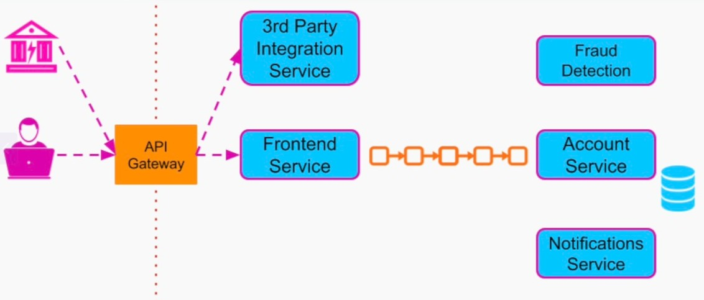

# Section 7: Software Architecture Patterns and Styles

- [Introduction to Software Architecture Patterns & Styles](#introduction-to-software-architecture-patterns--styles)
- [Multi-Tier Architecture](#multi-tier-architecture)
- [Microservices Architecture](#microservices-architecture)
- [Event Driven Architecture](#event-driven-architecture)

---

## Introduction to Software Architecture Patterns & Styles

### Software Architectural Patterns

- General repeatable solutions to commonly occuring system design problems
- Common solutions to software architectural problems that involve **multiple components** that run as **separate runtine units**

---

### Software Architectural Patterns - History

- Software architects have been observing how other companies in similar industries went about solving similar design problems
- They tried to learn
  - What worked for them
  - What mistakes were made
- Those successful software architecture practices that became the Software Architectural Patterns

---

### Software Architectural Patterns - Incentives

**1. Save valuable time and resources**

- If other companies
  - Had very similar use cases to your problem
  - Operate on a similar scale
  - Already found an architecture and development practice that works for them
- Then it's better to take that knowledge and use it

---

**2. Avoid making our architecture resemble a *Big Ball of Mud***

- Big Ball of Mud: Anti Pattern of system that lucks structure where every service talks to every other service
  - tightly coupled
  - code duplication
  - no clear scope of responsibility for any of the components
- Many companies got into such situations due to
  - Rapid growth
  - Lack of overarching, well-defined software architecture
- A system that gets into this situation is very hard to
  - Develop
  - Maintain
  - Scale
- The way to avoid it is to stick to a well-defined software architectural pattern

---

**3. Other engineers / software architects can follow it**

- Everyone can read about the pattern we're following
- Understand exactly what to do and what not to do
---

### Final Notes

- All the software architectural patterns are just guidelines
- As systems evolve, certain architectural patterns may not fit us anymore
- We would need to migrate to a different architectural pattern that now fits us better
- Many companies already went through such migrations in the past so we can follow their best practices
  
---

## Multi-Tier Architecture

### Multi-Tier Architecture

Multi-tier architecture organizes our system into multiple physical and logical tears

Tier 1 ➡️ Tier 2 ➡️ Tier 3 ➡️ Tier 4

- **Logical separation** - Limits the scope of responsibility on each tier
- **Physical separation** - Allows each tier to be separately
  - Developed
  - Upgraded
  - Scaled

Important Note: **Multi-Tier** and **Multilayer** architecture are two different concepts

---

### Multi-Layer vs Multi-Tier Architecture

Multi-layer architecture, usually refers to the internal separation inside a single application into multiple logical layers or modules.

However, even if the application is logically separated into multiple layers, at runtime it **will run as a single unit** and will be considered as a **Single Tier Architecture**

- Layer 1
- Layer 2
- Layer 3
- Layer 4

**Multi-Tier Architecture**

We mean that the applications of each tier, physically run on **different infrastructure**

---

### Restrictions in Multi-Tier Architecture

Besides the benefits of the logical and physical separation, there are a few *restrictions* in this architectural pattern

**1. Client-Server Model**

It's pair of applications that belong to adjacent tiers, communicate with each other using the client-server model. Which is perfect for e.g. Restful APIs

**2. Not Skipping Tiers**

Keeps the tiers loosely coupled with each other, which allows us to easily make changes to each tier, without affecting the entire system

---

### Three-Tier Architecture

Most common and popular architectural pattern for *client-server*, *web-based services*

**Presentation Tier**

Contains the User Interface

- The responsibility of the Presentation Tier is
  - Display information to the user
  - Take the user's input
- Does not contain any business logic
- The code that runs in the client's browser is accessible and visible to the user
- It is an anti-pattern to include any business logic in this tier

Examples:
- Webpage
- Mobile App
- Desktop Application

---

**Application Tier**

Also referred to as Business Tier / Logic Tier

- Provides all the functionality and features
- Responsible for
  - Processing the data that comes from the Presentation Tier
  - Applying the relevant business logic to it

---

**Data Tier**

Responsible for storage and persistence of *user* and *business-specific* data

- Include files on file system
- A **Database**

---

### Three-Tier Architecture - Popularity

- Fits a large variety of use cases
- Any web-based service fits this model: Examples
  - Online Store
  - News Website
  - Video / Audio Streaming Service
- Easy to scale horizontally to
  - Take large traffic
  - Handle a lot of data

---

### Three-Tier Architecture - Scalability

- Presentation Tier
  - Does not need any scaling because it runs on users devices
  - Essentially scales by itself
- Application Tier
  - We can place application tier instances behind a **Load Balancer**
  - Run as many instances as we need
- Data Tier
  - Scale easily with a well established distributed database
  - We can scale with techniques such as
    - Replication
    - Partitioning

---

### Three-Tier Architecture - Concentration of the Logic

This architectural style is very easy to
- maintain
- develop

because all the logic is concentrated in one place: **Application tier** where all the backend development actually happens. We don't need to worry about the integration of multiple codebases, services / projects

---

### Three-Tier Architecture - Drawbacks

Three-Tier Architecture has **one** major drawback
  
- Monolithic structure of our logic tier
  - No business logic in the *presentation tier* and *data tier*
  - All our business logic is concentrated in a single codebase
  - Runs as a single runtime unit

---

### Three-Tier Architecture - Drawback Implications

**1. High CPU and memory consumption**

- Makes our application slower and less responsive
- May require us to start upgrading each computer we run our application on
- Vertical scaling is expensive and limited

---

**2. Low Development Velocity**

- Large and complex codebase is harder to
  - Develop
  - Maintain
  - Reason about
- More concurrent development will cause
  - More merge conflicts
  - Higher overhead
- We can mitigate this problem by
  - Logically splitting application's codebase into separate modules
  - Release new versions of those modules only when the entire application is upgraded
- Organizational scalability of the Three-Tier Architecture is limited

---

### Three-Tier Architecture - Conclusions

- It is the perfect choice for companies whose codebase is
  - Relatively small and not complex
  - Maintained by a small team of developers
- This includes
  - Early-stage startups
  - Well-established companies

---

### Two-Tier Architecture

Less common than Three-Tier Architecture but still pretty popular

- Tier 1
  - Presentation + Business Tier
  - Mobile App / Desktop Application
- Tier 2
  - Files
  - Database

---

### Two-Tier Architecture - Advantages

- Eliminates the overhead of the Logic Tier
- Provides a faster, more native experience to the users
- Examples include
  - Desktop / mobile versions of editors
    - Document
    - Image
    - Music

---

### Four-Tier Architecture

If we support multiple client applications in the presentation tier, that have different APIs / Data, we can introduce the **API Gateway** tier, that can take of 
- API
- Caching
- Security Tier

---

### Five-Tier Architecture

Extremely rare, normally more tiers do not provide much value and simply adds additional performance overhead

This overhead comes from the restriction against bypassing tiers

---

### Summary

- We learned about *Multi-Tier Architecture*
- *Multi-Tier Architecture* splits our system architecture into multiple *logical* and *physical* tiers
- *Three-Tier Architecture*
  - User cases
  - Scale and complexity of the code base that best fits this architectural model
  - When to consider other alternatives
- We concluded with few variations of the Multi-Tier Architecture
  - Two-Tier Architecture
  - Four-Tier Architecture

---

## Microservices Architecture

### Microservices vs Three-Tier Architecture

**Three-Tier / Monolithic Architecture**

- Presentation Tier
- Application Tier (Logic)
- Data Tier

Monolithic Application because Logic is concentrated in one single service.

**Monolithic architecture - Advantages**
- Perfect for Small teams
- Small and non complex codebase

**Monolithic architecture - Disadvantages**
- As the size and complexity of our codebase grow, it becomes difficult to
  - Troubleshoot
  - Add new features
  - Build
  - Test
  - Load in IDE
- We have problems in organizational scalability because
  - The more engineers we add to the team, the more code merge conflicts we get
  - Our meetings become larger, longer, and less productive
- Once we start seeing these problems, we should consider migrating our architecture towards *Microservices*

---

### Microservice Architecture

> Microservices Architecture organizes our business logic as a collection of loosely coupled and independently deployed services

> Each service is owned by a small team and has a narrow scope of responsibility

**Microservices Architecture - Advantages**
- **Smaller Codebase**
  - Development becomes easier and faster
  - Codebase loads instantaneously in our IDE
  - Building and testing becomes easier and faster
  - Troubleshooting / adding new features becomes easier
  - New developers can become fully productive faster
- **Better Performance and Horizontal Scalability**
  - Instances become less CPU intensive and less memory-consuming
  - Services can be scaled horizontally by adding more instances of low-end computers
- **Better Organizational Scalability**
  - Each service can be independently
    - Developed
    - Maintained
    - Deployed by a separate small team
  - Leads to high throughput from the entire organization
  - Each team is autonomous to decide on
    - Programming languages
    - Frameworks
    - Technologies
    - Release schedule / process
- **Better security (Falut Isolation)**
  - If we have an issue in one of the services, it is easier to isolate it and mitigate the problem

---

### Microservices - Considerations

**1. We don't get all these benefits out-of-the-box**

- If we don't follow best practices we can fall into the *Big Ball of Mud*

 **2. Overhead and challenges**

 ---

### Microservices - Organizational Decoupling

- We need to make sure that the services are logically separated such that **every change**
  - Can happen only in one service
  - Would not involve multiple teams

---

### Microservices - Best Practises

**1. Single Responsibility Principle (SRP)**

- Each service needs to be responsible for only one
  - Business capability
  - Domain
  - Resource
  - Action

Example 1: Online Dating Service

API Gateway Service
- Image Service
- User Profile Service
- Matching Service
- Billing Service
 
Example 2: Online Store Service

API Gateway Service
- Checkout Service
  - Billing Service
  - Tax Calculator Service
  - Shipping Service
  - + Product Inventory Service (Entity Oriented Services)
- Product Search Service
  - + Product Inventory Service

Can also break the API Gateway:
- Web API Gateway
- Mobile API Gateway
- Third Party API Gateway

---

**2. Separate Database Per Service**

If two services share a single database, then every single schema or document structure change
will require careful coordination between multiple teams

If each service has it's own database, then the database becomes an implementation detail of each service
and can be easily updated or replaced, completely transparently to the rest of the system

**Separate Database Per Microservice**

- Data has to be split in a way that each microservice can be *completely independent*
- *Data duplication* is an expected overhead

---

### Final Notes

- Following the best practices will allow us to succeed using Microservices
- We get all those benefits **despite** the complexity and overhead only when we reach a certain *complexity* and *organizational* scale
- It's best to start with the simple Monolithic approach first
- When Monolithic Architecture stops working, we should consider Microservices

---

### Summary

- A popular and useful architectural pattern and style - *Microservices Architecture*
- Benefits of Microservices Architecture style that result in
  - Higher organizational and operational scalability
  - Better performance
  - Faster development
  - Security
- Considerations and best practices to achieve all those benefits

---

## Event Driven Architecture

### Synchronous Communication in Microservices Architecture

**Microsercice A needs to**

- be aware of Microservice B
- what API the Microservice B provides and how to call it
- call Microservice B **synchronously** and wait for it's response

Microservice A has a **dependency** on Microservice B

---

### Event-Driven Architecture - Events

**Instead of**

- Direct messages that issue commands
- Requests that ask for data

we have only **events**

> An event is an immutable statement of a fact or a change

---

### Events - Examples

- Fact Events
  - User clicking on a digital ad
  - Item being added to a shopping cart
- Change Events
  - Player of a video game
  - IoT device (vacuum cleaner)

---

### Event-Driven Architecture - Components

Event Emitter / Producer ➡️   🔳 🔳 🔳 Event Channel: Message Broker 🔳 🔳 🔳   ➡️ Consumer

---

### Decoupling of Microservices

If Microservice A communicates with Microservice B by producing events, the dependency of Microservice A on Microservice B is removed.

Microservice A doesn't need to know anything about the existence of Microservice B

And once Microservice A produces the event, it doesn't need to wait for any response from any consumer.

- We can decouple microservices effectively as
  - Services don't need to know about each other's API
  - All messages are exchanged asynchronously
- Benefits
  - Higher scalability
  - More services can be added to the system without any changes

---

### Online Banking Service

- Frontend Service
  - provides the UI and takes in the user input
    - e.g. money deposits, transfers between accounts
- Account Service
  - maintains and updates the balance between each user

Now every action that the user performs on their account can be **events** that are produced by the frontend service

The Account Service simply subscribes to those events

Now because we decoupled the two services using the message broker:
- we can easily add a mobile Notifications Service which subscribes to same channel
  - can send Push Notifications to the users mobile device
- we can add a fraud detection service
- we can add another Producer service that can integrate with other 3rd party services
  - e.g. utility companies that charge our client automatically for gas, electricity or water
  - payroll services to perform direct deposits to the client's account on behalf of the client's employer

---

