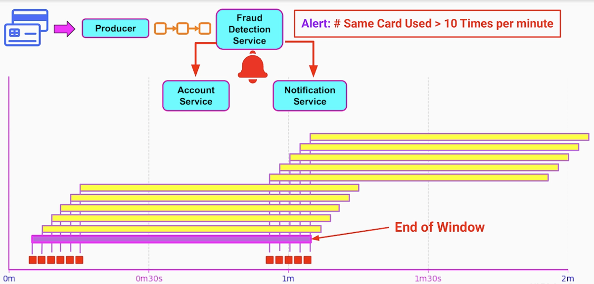

# Section 8: Strategies for Processing Infinite Streams of Events

- [Introduction to Event-Stream Processing and Tumbling Window Strategy](#introduction-to-event-stream-processing-and-tumbling-window-strategy)
- [Hopping Window Event-Stream Processing Strategy](#hopping-window-event-stream-processing-strategy)
- [Sliding Window Event-Stream Processing Strategy](#sliding-window-event-stream-processing-strategy)

---

## Introduction to Event-Stream Processing and Tumbling Window Strategy

In many cases, to get meaningful insights, we need to aggregate and analyze a series of events.

We use finite subsets of events by chopping those infite streams into manageable pieces of data.

By using **finite windows**, we can analyze streams of data almost in real time.

---

### Importance of Event-Stream Processing

- Anomaly Detection
- Fraud Detection
- Pattern Recognition
- Rate Limiting
- Recommendations Service

when each event own each own, does not carry sufficient information

---

### Usage of Event-Stream Processing Strategies

- Microservices and Event-Driven Architecture
- Big Data Pipelines
  - the volume of incoming events, is not only unbounted but also very high

---

### Tumbling Window

The consumer application or microservice, devides the time into fixed back-to-back, non-overlapping time buckets
where each event falls only to one window.

Once a window it's open, every event that the consumer consumes, will be added only to the currently active window.

When we reach the end of the window, the consumer aggregates those events and produces the result as a single event.

This result, can be 
- a new event to another channel
- a new data point
- an alert
- or a DB record

Once the current window it's closed, a new window it's created for the same fixed duration. All the new events will be bucketed in this new window.
The old data from the previous window, it is discarted and doesn't consume any more resources.

Message broker is generally unaware of the concept of this window. The consumer is full responsible for buffering those events 
typically in memory till the window expires. 
- the longer the window, the larger the memory footprint

---

### Tumbling Window - Example 1

Capturing and displaying the average meaurument from sensor
- temperature of weather tower / energy usage of a vacuum cleaner in a 10 second window

We can apply a technique called: trimmed mean. Allows us to throught away e.g. 
- 10% of the highest values
- 10% of lowest values

and calculate a more accurate average measurement for each window

---

### Tumbling Window - Example 2

Log analysis coming from production machines.

We can use the tumbling window aligned to every round hour and:
- look at the logs of production machines
- calculate the error rate in the last hour

If we detect in a certain window that the error rate exceeds some threshold, we can send an alert to the notification service
- will send a text or email to an engineer on call

---

### Tumbling Window - Example 3

On commerce systems, where different sellers can sell their products to our user base:

We can use the tumbling window to analyze the revenue in our system every 24 hours.

At the end of each window, we group sales by seller and produce the total revenue for each seller in the last 24 hours
- data can be stored in a Database
- published as an event which can be consumed by email service and be send to each seller daily
- can also be sent to the Payout Service

---

### Tumbling Window Strategy - Props

- Simple
- Ideal for
  - Periodic / discrete aggregations
  - Minimal memory / computation overhead
  - Clear time boundaries: minures / hours / days
- Ideal when each event logically belongs to only one window

---

### Tumbling Window Strategy - Cons

- Low granularity of results
  - The frequency of insights is limited to the window size
    - e.g. in log analysis if we have a spike in errors, we will get that insight
      - only at the end of the hour long window
      - can already have serious financial impact
    - e.g. in the ecommerce system, the seller will only get fresh data about revenue
      - when the 24h window closes and results are published
- **Not** a good strategy for pattern / trend recognition
  - e.g. trend will not be discovered if there are spikes around the window boundary

---

## Hopping Window Event-Stream Processing Strategy

### Tumbling Window - Quick Reminder

- Devides time into
  - Fixed-size
  - Back-to-back windows
- Disadvantages
  - Dependency of the frequency of results on the size of the window

**Tumbling Window - Short Window, Hight Frequency**

If the volume of events is low or sporadic, we will have a lot of windows with nothing / very little data to aggregate

**Tumbling Window - Long Window, Low Frequency**

The results of an aggregation, will be produced by the consumer of the events, only once an hour / once a day

---

### Hopping Window

- Each window has a fixed-time interval
- Hopping windows overlap with each other
- Separated by a fixed hop called: **Advance Interval**
- Advance Interval can be
  - smaller that the window duration
  - equal to the window duration
  - larger than the window duration

If the Advance Interval is equal to the Window duration then it's the same as Tumbling Window

---

### Hopping Window - Smaller Than Window Duration

When Window 1 is closed, all the events captured within it's time boundaries, will be analyzed and the consumer application will produce
- a sum
- an average
- some other single metric or summary

one advance interval later, the second window will be closed and consumer application will produce another result

We essentially get **continuous monitoring** or trend analysis with much more **frequent updates**

---

### Hopping window vs Tumbling Window

If we want to increase the window size and analyze more events in every window, the frequency of publishing the events doesn't change.

Frequency it's completely independent of the window size.

---

### Hopping window - Events in Different Windows

The same events can be part of several windows. 

The same data received by the event consumer, will be processed as part of multiple aggregations

---

### Hopping Window - Use Cases

- Near real-time analytics
  - Stock trading
    - Average
    - Median
    - Maximum
    - Minimum price of a stock / asset
      - Windows size: 1 minute / 1 hour
      - Advance interval: 1 second
  - Error Logs Analysis
    - Window size: 1 hour
    - Advance interval: 1 minute
    - We can get an update on our error rate, for the last hour every minute

---

### Hopping Window - Pros

- Produce results of processing events more frequently
- Great for UIs, and dashboards monitored by humans
- Allows us to respond to changes / insights faster and sooner

---

### Hopping Window - Cons

- The events are aggregated by the "consumer" in memory
- Instead of one window at a time we have
  - Multiple windows
  - More events in flight
    - Increases the memory footprint of the consumer microservice
- More frequent aggregation of events
  - More CPU resources
  - More network resources

---

### Hopping Window - Temperature Measurements

If we set the advance interval to be larger than the window size, we simply revert to tumbling window strategy.

Now, we have **gaps** between the windows.

Useful when the volume of events is very large but doesn't have high variability
- e.g. sensor data that doesn't change to often / don't need to process all of it

This way we basically sample those events with fixed windows and discard the data in between

---

## Sliding Window Event-Stream Processing Strategy

### Sliding Window - Motivation

**Fraud Detections Service at a Financial System / Bank**

Rule: Alert if Same Card Used > 10 Times per minute
- Trigger an alert to freeze account
- Send a Notification to the owner of the credit card

Both Tumbling and Hoping window won't detect correctly the fraudulant activity 

---

### Sliding Window - Strategy

- Each window has a fixed duration
- Every new event will start a new fixed size window
- The consecutive interval between windows it's dynamic
  - align to events instead of points fixed in time

This strategy is great for events that arrive at Irregular Intervals

For any active window, as soon as it's duration passes, the results are calculated / published and the window is closed

---

### Sliding Window Strategy - Example

**API Rate Limiting / Throttling**

Every time a user sends a request to our system or a third party application makes an API call to our system
- we can emit an event to a message broker
- those events can be processed by a rate limiting microservice
- microservice aggregates the events by origin
- if each user exceeds it's quata it blocks the origin
- Responds with an HTTP 429 - Too Many Requests
  - prevent DDoS
  - make sure 3rd party client applications get an equal response time

---

### Sliding Window - Pros

- Excellent strategy for
  - Real-time monitoring
  - Pattern detection
- Sliding window vs Hopping Window
  - Advance interval is flexible
  - Advance interval is always as small as possible

---

### Sliding Window - Cons

- Processing and memory costs are higher
  - Especially if the volume of events is very high
  - Number of windows is directly correlated to the number of events

---

