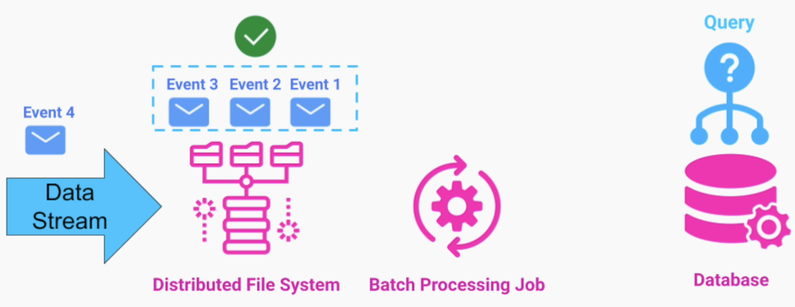
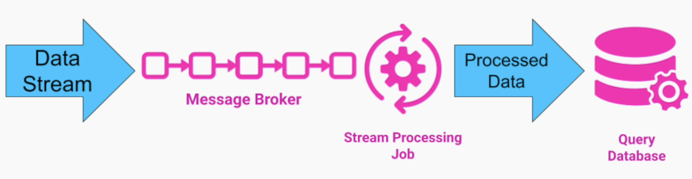

# Section 9: Big Data Architecture Patterns

- [Introduction to Big Data](#introduction-to-big-data)
- [Big Data Processing Strategies](#big-data-processing-strategies)

---

## Introduction to Big Data

### Big Data - Definition

Datasets that are either
- Too large in size
- Too complex in structure
- Come to our system at a high rate

that exceeds the capacity of a traditional application

---

### Characteristics of Big Data

**1. Volume**

Refers to the quantity of data that we need to:
- Process
- Store
- Analyze

In Big Data, we are talking about *large quanitites* of data, in the order of magnitudes of:
- Terabytes
- Petabytes

**Example Technology fields with High Volume of Data**
- Internet Search Companies
- Medical Software Systems
- Real Time Security Systems
- Weather Prediction System

---

**2. Variety**

- Traditional non-Big Data systems - Work with *well-defined* types of data
- In Big Data - *Large variety of unstructured* data from multiple sources
- Data Fusion - Combining data together
  - Helps in finding **hidden patterns** and **insights** for our organization

**Examples**
- Social Media Services / Apps
  - Prediction
  - Internet Trends
  - Clusters of Interest

---

**3. Velocity**

- In Big Data we have a *continuous stream* of data that comes to our system at a *very high rate*
- The high rate of incoming data can be either due to:
  - Large scale of our system
  - High frequency of events

**Example**

- Online Store on a Global Scale
  - Very large number of users
- Internet of Things (IoT)
  - e.g. vehicles can generate a lot of data from their sensors

---

### Insights from Analyzing Big Data

- Can provide a significant advantage over our competitors
- Come in the form of
  - Visualization
  - Querying Capabilities
  - Predictive Analysis

**1. Visualization**

A powerful tool that allows humans to make sense of *meaningless data* stored in some file 
system or database 

**2. Querying Capabilities**

In many cases after we collect a lot of data we don't know
- What to do with it
- How it can benefit us the right way

Querying Capabilities allow us to run *ad-hoc analysis* on that data

Helps us find those insights / patterns that were not obvious before

**3. Predicitve Analysis**

- We can build algorithms or Machine Learning models to
  - Predict the behavior of our users
  - Suggest products that they will likely purchase
- We can detect anomalies in the system by analyzing logs from servers to
  - Automatically roll back a new release
  - Alert the engineers On-Call

---

## Big Data Processing Strategies

### Big Data Analysis

Let's assume we are getting a continuous stream of data coming from different sources into our system in real time

- user interactions on our social media platform
- logs or metrics coming from production application instances
- data coming from transportation devices
  - planes, trains, autonomous cars

We want to process it so we can analyze it and provide 
- Insights
- Visualization
- Prediction

---

### Batch Processing

We store the incoming data either to a
- Distributed database
- Distributed File System

Data is Never Modified, only we append to it as more data arrives

The key principal in Batch Processing is we do not process each piece of data individually
- We process them in Batches of records
- We typically perform this processing in a fixed schedule
  - can also run it based on a fixed number of records
- can run on any schedule that fits our use case
  - once  month
  - once a day
  - once an hour etc
- The code for this Batch Processing Job is written by us

The results / view can be stored in an **Index Database** that we can easily query

---

### Batch Processing - Important Note

- The view we generate should reflect the knowledge we have about our **entire dataset**
- Depending on the use case, Batch Processing can:
  - Pick up only the data that arrived recently
  - Process the entire data set from scratch

---

### Batch Processing Example 1 - Online Learning Platform

**Events**
- Course Progress Events
  - Every minute that a student watches, we get an event into our system
- Course Review Events

Estimation: 100 million students x 0.1 (10% active) = **1 million events / min** (Big Data)

- We do not need to process any of this data in real-time
- If we process data in batches, we can provide a lot of mission-critical insight for our busines

e.g. we can use the data about the content consumption for each course to compensate the instructor

Also, we can re-calculate the course rating daily 

We can also do Data Fusion 
- ➡️ Weighted Course Rating
- ➡️ Course Ranking

Can also make a Machine Learning model and try to predict what type of students can benefit from each course and 
- send them push notifications
- Recommend Courses

---

### Batch Processing Example 2 - Search Engine Service

We have large amount of data that we want to provide search capability e.g.
- websites
- articles
- images

We can crawl the entire Dataset periodically and organise Index and Store in a way that is very easy and fast to search for.

Because this crawling process takes a very long time anyway and there is no real need or expectation that every new website or article, would appear in search results immediately, this is also perfect use case for **batch processing**

---

### Batch Processing - Advantages

1. Easy to implement
2. High availability
   - Until a currently running job is done
     - Analyzing the entire dataset
     - Providing the new view
   - We have the old view still available for querying
     - *No downtime* for users
3. Better efficiency
4. Higher fault tolerance
   - If we push bad code to our processing job, we still have our original data
   - To produce a new and correct view of our data, we can
     - Fix our bug
     - Redeploy the processing job
     - Run it again to analyze our entire dataset
5. Complex and deep analysis of large datasets

---

### Batch Processing - Drawbacks

- Long delay between incoming data and result from the processing job
- By running our Batch Processing job
  - We don't get a real-time view of the data coming in
  - We can't respond to the platform fast enough
- This forces our users to wait a long time before they can get feedback on actions

**Examples**

e.g. In an Online Store that uses batch processing to index different products on our platform for search purposes,
a merchant who just added or updated the product description, may be surprised why the product doesn't show up in search results

e.g. In a Log / Metrics Analysis system that collects streams of log files and data points from thousand of production application instances, we have to be able to visualize all this data in real time
- otherwise if there is a production issue in the database, the engineers on call have to have those logs and metric graphs

e.g. In Online Stock Trading System we have to be able to take in both bids and asks and match them together so people can trade and update the price in each stock in real time

---

### Real-Time Processing

We put each new event that comes to our system in a queue or message broker and on the other end we have a processing job that **processes each individual data record** as it comes

After that record is processed, the processing job updates the database that provides querying capabilites for real time visualization and analysis

---

### Real-Time Processing - Advantages

- We can analyze and respond to data as it comes into our system immediately
  - We don't have to wait for a job to process it

---

### Real-Time processing - Drawbacks

- It's hard to do any complex analysis in real-time
  - We don't get much insight into our system
- Doing data-fusion / analyzing historical data is impossible
  - We're limited to the recent data that we currently have to provide insights / predictions

---

### Summary

- Two different strategies for processing large volumes of data
  - Batch Processing
  - Real-Time Processing
- We covered a few use cases that fit each of those models
- We compared the two strategies by listing their advantages and disadvantages

---

  

