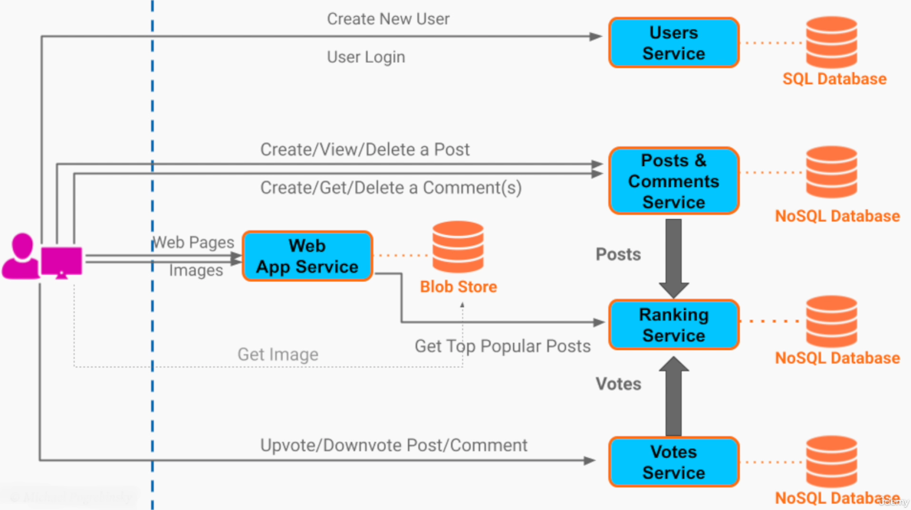

# Section 10: Software Architecture & System Design Practice

- [Design a Highly Scalable Discussion Forum 1 - Requirements & API](#design-a-highly-scalable-discussion-forum-1---requirements--api)
- [Design a Highly Scalable Discussion Forum 2 - Functional Architecture Diagram](#design-a-highly-scalable-discussion-forum-2---functional-architecture-diagram)

---

## Design a Highly Scalable Discussion Forum 1 - Requirements & API

### System Design Step-By-Step Process

1. **Ask Questions** to capture:
   - a. *Funcitonal* Requirements
   - b. *Non-Functional* Requirements
   - c. System *Constraints*
2. Define the System's API
3. Create a **Software Architecture Diagram** to fulfill the *Functional* Requirements
4. Refine the **Software Architecture Diagram** to address the *Non-Functional* Requirements

---

### System Design - Reminder

For System Design questions there is **no one correct** solution

The most important thing: Make the **right trade offs** based on the given requirements

---

### Design Problem - High Level Overview

- Highly Scalable Public Discussion Forum (like Reddit, Quore, Stack Overflow, etc)
  - Post questions / news to the public
  - Comments on existing posts
  - Upvote / downvote posts / comments
  - Feed of most popular posts

---

### Design Problem - Solution Steps

- Gathering Functional / Non - Functional Requirements
- Defining the System API
- Architecture Diagram - Addressing Functional Requirements
- Architecture Diagram - Addressing Non-Functional Requirements

---

### System Design Initial Questions

**Examples**

- Can anyone post or view posts / comments ?
- What can a post contain? (text / images / video)
- What is the meaning of "most popular posts"?
- What is the structure of comments? (flat list vs tree)

---

### Functional Requirements

1. A user can **signup** and **login** to post, vote, or comment
2. A user should be able to create a **new post** that contains a
   - Title
   - Topic tags
   - Body (text or uploaded images)
3. A user should be able to **comment** on any existing post
4. **Comments** are ordered **chronologically** as a **flat list**
5. User can to **delete** their own **post** or **comment**
6. **Logged-in** user can **upvote/downvote** an existing **post/comment**
7. Present the top **most popular posts** in the **last 24 hours** on the homepage
  - Popularity = Upvotes - Downvotes

---

### Non - Functional Requirements

1. **Scalability** (millions of daily users)
2. **Performance** (Less than 500 ms Response Time 99p)
3. **Fault Tolerance / High Availability** (99.9%)
4. **Availability + Partition Tolerance** (AP over CP)
5. **Durability**

---

### System Constraints

Certain technologies or cloud ventors but for now they will be ignored

---

### API Definition

**REST** API over HTTP

---

### REST API Definition - Step by Step Process

1. Identifying Entities
2. Mapping Entities to URIs
3. Defining Resources' Representations
4. Assigning HTTP Methods To Operations on Resources

---

### REST API Definition - 1. Identifying the Different Entities

- Users
- Posts
- Images
- Comments
- Votes

---

### REST API Definition - 2. Mapping Entities to URIs

- Users
  - `/users`
  - `/users/{user-id}`
- Posts
  - `/posts`
  - `/posts/{post-id}`
- Comments (sub-resource)
  - `/posts/{post-id}/comments`
  - `/posts/{post-id}/comments/{comment-id}`
- Images (sub-resource)
  - `/posts/{post-id}/images`
  - `/posts/{post-id}/images/{image-id}`
- Votes (sub-resource of post or comment)
  - `/posts/{post-id}/vote`
  - `/posts/{post-id}/comments/{comment-id}/vote`

---

### REST API Definition - 3. Defining Resources' Representations

**Single Post**

```
GET /posts/{post-id}

{
  "post_id": "14245bac",
  "title": "How do I make money with stocks?",
  "user_id": "1234acd",
  "topics": ["investing", "stocks", "trading"],
  "upvotes": 5,
  "downvotes": 1,
  "body": "...."
}

```

**Comments Collection**

```
GET /posts/{post-id}/comments/{comment-id}

{
  "post_id": "1424bac",
  "comments": [
    {
      "comment_id": 1234,
      "body": "I agree",
      "user_id": "abd54232",
      "upvotes": 50,
      "downvotes" 3
    },
    {
      "comment_id": 4321,
      "body": "I don't this so, because...",
      "user_id": "5423adc",
      "upvotes": 7,
      "downvotes" 6
    }
  ]
}


```

---

### REST API Definition - 4. Assigning HTTP Methods To Operations on Resources

- Users
  - `POST /users/create` ➡️ Create New User
  - `POST /users/{user-id}` ➡️ Login Existing User
      - *Create* Session operation / Auth Token
- Posts
  - `POST /posts` ➡️ Create New Post
  - `GET /posts` ➡️ View Posts
  - `GET /posts/{post-id}` ➡️ View a Post
  - `DELETE /posts/{post-id}` ➡️ Delete a Post
- Comments
  - `POST /posts/{post-id}/comments` ➡️ Create New Comment
  - `GET /posts/{post-id}/comments` ➡️ View Post's Comments
  - `DELETE /posts/{post-id}/comments/{comment-id}` ➡️ Delete a Comment
- Votes
  - `POST /posts/{post-id}/vote` ➡️ Upvote / Downvote a Post
  - `POST /posts/{post-id}/comments/{comment-id}/vote` ➡️ Upvote / Downvote a Comment
- Images
  - `POST /posts/{post-id}/images` ➡️ Upload an Image
  - `GET /posts/{post-id}/images/{image-id}` ➡️ Get an Image to Browser
 
---

### API Considerations - Many Posts

The number of active posts can be very big (900k Posts)

**API Pagination**

`GET /posts?limit=20&offset=0`

`GET /posts/{post-id}/comments?limit=40&offset=0`

**API Pagination Before Infinite Scrolling**

When user scrolls at the end of the page, the front end code sends a request for the next batch of comments

---

### Summary

- Started with Initial vague / ambiguous requirements
- Asked questions
- Gathered functional requirements
- Gathered / defined the desired quality attributes
- API Definition: REST API
  - Identified entities
  - Mapped entities to URIs
  - Defined the representation of our resources
  - Assigned operations to HTTP methods
- API Observations
  - API Pagination

---

## Design a Highly Scalable Discussion Forum 2 - Functional Architecture Diagram


### Functional Requirements

1. A user can **signup** and **login** to post, vote, or comment
2. A user should be able to create a **new post** that contains a
   - Title
   - Topic tags
   - Body (text or uploaded images)
3. A user should be able to **comment** on any existing post
4. **Comments** are ordered **chronologically** as a **flat list**
5. User can to **delete** their own **post** or **comment**
6. **Logged-in** user can **upvote/downvote** an existing **post/comment**
7. Present the top **most popular posts** in the **last 24 hours** on the homepage
  - Popularity = Upvotes - Downvotes

---

### Architectural Diagram




Using CQRS pattern, we pull data from both microservices by a new microservice ➡️ Ranking Service

This Service will have a dedicated optimized read database to serve the posts in a sorted and ready to be served way.

---

### Present popular posts in the last 24 hours - Observations

- Most Posts are not active in the last 24 hours. We only need to sort a small number of posts
- Recalculating and ranking the posts continuously is expensive
- No strict requirement to keep the list of posts, sorted at all times

**Batch Processing**

Combining the Batch Processing and the CQRS pattern, the ranking service will run maybe once in 10 / 30 / 60 minutes.

Everytime it runs it will request the voting service to give it all the new votes that happened in the last 24 hours.

The ranking service it will then sum up the upvotes and downvotes per post and sort the posts by popularity.

The it will pull the content of those posts from the Posts & Comments Service and store the sorted list of posts in each database.

Whenever a user opens the website that request will go to the ranking service and send back the 20 most popular posts and paginate for the rest.

---

