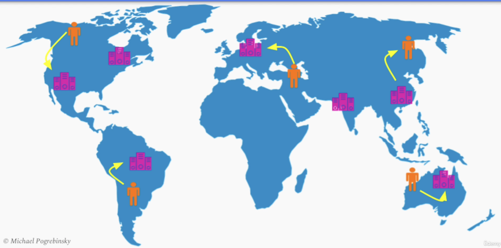

# Section 10: Software Architecture & System Design Practice

- [Design a Highly Scalable Discussion Forum 1 - Requirements & API](#design-a-highly-scalable-discussion-forum-1---requirements--api)
- [Design a Highly Scalable Discussion Forum 2 - Functional Architecture Diagram](#design-a-highly-scalable-discussion-forum-2---functional-architecture-diagram)
- [Design a Highly Scalable Discussion Forum 3 - Final Software Architecture](#design-a-highly-scalable-discussion-forum-3---final-software-architecture)
- [Design an E-commerce Marketplace Platform 1 - Requirements & Sequence Diagram](#design-an-e-commerce-marketplace-platform-1---requirements--sequence-diagram)
- [Design an E-commerce Marketplace Platform 2 - Functional Diagram](#design-an-e-commerce-marketplace-platform-2---functional-diagram)

---

## Design a Highly Scalable Discussion Forum 1 - Requirements & API

### System Design Step-By-Step Process

1. **Ask Questions** to capture:
   - a. *Functional* Requirements
   - b. *Non-Functional* Requirements
   - c. System *Constraints*
2. Define the System's API
3. Create a **Software Architecture Diagram** to fulfill the *Functional* Requirements
4. Refine the **Software Architecture Diagram** to address the *Non-Functional* Requirements

---

### System Design - Reminder

For System Design questions there is **no one correct** solution

The most important thing: Make the **right trade offs** based on the given requirements

---

### Design Problem - High Level Overview

- Highly Scalable Public Discussion Forum (like Reddit, Quore, Stack Overflow, etc)
  - Post questions / news to the public
  - Comments on existing posts
  - Upvote / downvote posts / comments
  - Feed of most popular posts

---

### Design Problem - Solution Steps

- Gathering Functional / Non - Functional Requirements
- Defining the System API
- Architecture Diagram - Addressing Functional Requirements
- Architecture Diagram - Addressing Non-Functional Requirements

---

### System Design Initial Questions

**Examples**

- Can anyone post or view posts / comments ?
- What can a post contain? (text / images / video)
- What is the meaning of "most popular posts"?
- What is the structure of comments? (flat list vs tree)

---

### Functional Requirements

1. A user can **signup** and **login** to post, vote, or comment
2. A user should be able to create a **new post** that contains a
   - Title
   - Topic tags
   - Body (text or uploaded images)
3. A user should be able to **comment** on any existing post
4. **Comments** are ordered **chronologically** as a **flat list**
5. User can to **delete** their own **post** or **comment**
6. **Logged-in** user can **upvote/downvote** an existing **post/comment**
7. Present the top **most popular posts** in the **last 24 hours** on the homepage
  - Popularity = Upvotes - Downvotes

---

### Non - Functional Requirements

1. **Scalability** (millions of daily users)
2. **Performance** (Less than 500 ms Response Time 99p)
3. **Fault Tolerance / High Availability** (99.9%)
4. **Availability + Partition Tolerance** (AP over CP)
5. **Durability**

---

### System Constraints

Certain technologies or cloud ventors but for now they will be ignored

---

### API Definition

**REST** API over HTTP

---

### REST API Definition - Step by Step Process

1. Identifying Entities
2. Mapping Entities to URIs
3. Defining Resources' Representations
4. Assigning HTTP Methods To Operations on Resources

---

### REST API Definition - 1. Identifying the Different Entities

- Users
- Posts
- Images
- Comments
- Votes

---

### REST API Definition - 2. Mapping Entities to URIs

- Users
  - `/users`
  - `/users/{user-id}`
- Posts
  - `/posts`
  - `/posts/{post-id}`
- Comments (sub-resource)
  - `/posts/{post-id}/comments`
  - `/posts/{post-id}/comments/{comment-id}`
- Images (sub-resource)
  - `/posts/{post-id}/images`
  - `/posts/{post-id}/images/{image-id}`
- Votes (sub-resource of post or comment)
  - `/posts/{post-id}/vote`
  - `/posts/{post-id}/comments/{comment-id}/vote`

---

### REST API Definition - 3. Defining Resources' Representations

**Single Post**

```
GET /posts/{post-id}

{
  "post_id": "14245bac",
  "title": "How do I make money with stocks?",
  "user_id": "1234acd",
  "topics": ["investing", "stocks", "trading"],
  "upvotes": 5,
  "downvotes": 1,
  "body": "...."
}

```

**Comments Collection**

```
GET /posts/{post-id}/comments/{comment-id}

{
  "post_id": "1424bac",
  "comments": [
    {
      "comment_id": 1234,
      "body": "I agree",
      "user_id": "abd54232",
      "upvotes": 50,
      "downvotes" 3
    },
    {
      "comment_id": 4321,
      "body": "I don't this so, because...",
      "user_id": "5423adc",
      "upvotes": 7,
      "downvotes" 6
    }
  ]
}


```

---

### REST API Definition - 4. Assigning HTTP Methods To Operations on Resources

- Users
  - `POST /users/create` ➡️ Create New User
  - `POST /users/{user-id}` ➡️ Login Existing User
      - *Create* Session operation / Auth Token
- Posts
  - `POST /posts` ➡️ Create New Post
  - `GET /posts` ➡️ View Posts
  - `GET /posts/{post-id}` ➡️ View a Post
  - `DELETE /posts/{post-id}` ➡️ Delete a Post
- Comments
  - `POST /posts/{post-id}/comments` ➡️ Create New Comment
  - `GET /posts/{post-id}/comments` ➡️ View Post's Comments
  - `DELETE /posts/{post-id}/comments/{comment-id}` ➡️ Delete a Comment
- Votes
  - `POST /posts/{post-id}/vote` ➡️ Upvote / Downvote a Post
  - `POST /posts/{post-id}/comments/{comment-id}/vote` ➡️ Upvote / Downvote a Comment
- Images
  - `POST /posts/{post-id}/images` ➡️ Upload an Image
  - `GET /posts/{post-id}/images/{image-id}` ➡️ Get an Image to Browser
 
---

### API Considerations - Many Posts

The number of active posts can be very big (900k Posts)

**API Pagination**

`GET /posts?limit=20&offset=0`

`GET /posts/{post-id}/comments?limit=40&offset=0`

**API Pagination Before Infinite Scrolling**

When user scrolls at the end of the page, the front end code sends a request for the next batch of comments

---

### Summary

- Started with Initial vague / ambiguous requirements
- Asked questions
- Gathered functional requirements
- Gathered / defined the desired quality attributes
- API Definition: REST API
  - Identified entities
  - Mapped entities to URIs
  - Defined the representation of our resources
  - Assigned operations to HTTP methods
- API Observations
  - API Pagination

---

## Design a Highly Scalable Discussion Forum 2 - Functional Architecture Diagram


### Functional Requirements

1. A user can **signup** and **login** to post, vote, or comment
2. A user should be able to create a **new post** that contains a
   - Title
   - Topic tags
   - Body (text or uploaded images)
3. A user should be able to **comment** on any existing post
4. **Comments** are ordered **chronologically** as a **flat list**
5. User can to **delete** their own **post** or **comment**
6. **Logged-in** user can **upvote/downvote** an existing **post/comment**
7. Present the top **most popular posts** in the **last 24 hours** on the homepage
  - Popularity = Upvotes - Downvotes

---

### Architectural Diagram


Using CQRS pattern, we pull data from both microservices by a new microservice ➡️ Ranking Service

This Service will have a dedicated optimized read database to serve the posts in a sorted and ready to be served way.

---

### Present popular posts in the last 24 hours - Observations

- Most Posts are not active in the last 24 hours. We only need to sort a small number of posts
- Recalculating and ranking the posts continuously is expensive
- No strict requirement to keep the list of posts, sorted at all times

**Batch Processing**

Combining the Batch Processing and the CQRS pattern, the ranking service will run maybe once in 10 / 30 / 60 minutes.

Everytime it runs it will request the voting service to give it all the new votes that happened in the last 24 hours.

The ranking service it will then sum up the upvotes and downvotes per post and sort the posts by popularity.

Then it will pull the content of those posts from the Posts & Comments Service and store the sorted list of posts in each database.

Whenever a user opens the website that request will go to the ranking service and send back the 20 most popular posts and paginate for the rest.

---

## Design a Highly Scalable Discussion Forum 3 - Final Software Architecture

### Non - Functional Requirements

1. **Scalability** (millions of daily users)
2. **Performance** (Less than 500 ms Response Time 99p)
3. **Fault Tolerance / High Availability** (99.9%)
4. **Availability + Partition Tolerance** (AP over CP)
5. **Durability**

---

### Scalability

We can place a **load balancer**, in front of 
- the web app service
- each one of the other services

Then we can place an **API Gateway**, to decouple the front end code from the system's internal structure
- it will increase organizational scalability


On Posts & Comments Database side, as we store more posts and comments, our db instance may run out of space.
It also may not be able to handle the traffic from so many users


The solutions is to **sharding our posts and comments collection** across different database shards
- shard the posts by applying a hash function
  - `Hash(post_id) -> Shard(i)`
  - should evenly distribute the posts across different shards
- the comments should be in the same instances with the posts
  - if we hash their ids it will result in an inefficient broadcast operation to all our database shards
  - should hash them again by `post_id` to have them on the same shard
  - `Hash(post_id) -> Shard(i)`
  - Problem: If one popular post grows to so many comments that they cannot fit on a single shard, we won't be able to split them
    - also performance bottleneck, because to many operations will go to the same shard
    - Solution: can shard on a compound index `(post_id, comment_id)`
    - Should also use a **Range Sharding Strategy** instead of hash function


---

### Coumpound Index + Range Shard Strategy

We can think of the Compund Index as a separate data structure that sorts our data first
- by the first key: post_id
- and then by the second key: comment_id

This way, using a range sharding strategy, the database splits the data into ranges and distributes them across different shards


However, if one of the posts gets too many comments, the database can still split those ranges and put comments of the same post, on different shards

This way we get a good balance between scalability and performance, since each request for a list of consecutive comments for a given post, will likely result to a call to **one shard** or maybe two shards at the worst case

---

### Performance

Potential performance bottleneck
- Image Blob Store
- Static HTML pages

**Images**

Every time a user loads a post of a news feed with the most popular posts, we need to load images from our system
- utilize a global network of **CDN servers**
- using a PULL model with a very long TTL
- images will be distributed among the CDN edge servers

This reduces the traffic load on our system and also reduces the page load time for the users.

**Static HTML pages**

We can also offload them to a CDN which will 

- reduce the load of our web app service
- reduce the time of all our pages load on user's device

**API Gateway Level**

We can also introduce **caching on API Gateway level**. 

At peak times, when a small group of posts is viewed by many users simultaneously, we can store those posts in a Cache and update it every few minutes.

This will also reduce the response time for our users, and goes hand in hand with our decision to prioratize availability over consistency.


---

### Performance - Database Indexing

**Posts & Comments Service**

We can add an **index** on the `post_id` which will make searching for a particular post in a constant time instead of scanning through all of our collection of posts.

We can use the same compound index we created for sharding the comments using the `post_id` and `comment_id`.
- requesting a batch of comments for a given post will also be much faster

**Votes Service**

When we show a post or a command on the UI, we want to show the overall number of upvotes
- Show total upvotes / downvotes
  - for each post
  - for each comment

We can introduce **a message broker** between the voting service and the post and comment service
- we can add **downvotes** and **upvotes** in posts and comments collections

Any time a user downvotes or upvotes a post, the voting service will add that entry to each own database
- and publish it as an event to the posts and comments service
- post and comments service can consume this event, and update the total number of upvotes / downvotes
- helps if we have a short but sudden traffic spike
  - users will not get the most up to date value for the total number of upvotes / downvotes (availability over consistency)

---

### Fault Tolerance / High Availability

To ensure we don't lose any data we can introduce **database replication**, if a database instance or database shard crashes.

Similarly, every message broker, data store and microservice is replicated, adding to our overall system tolerance


In addition, we can run our system across multiple data centers in different geographical locations and utilize a **Global Load Balancinig Service**

This way we can always fallover to another region, if there is a natural disaster in one of those regions.

This also improves our performance as our system gets physically closer to our users on different continents



---

### Availability + Partition Tolerance (AP over CP)

We prioritize availability over consistency when it comes to data, so our database is configured to be available and partition tolerant and that's in addition to all the caching and other optimizations we have already made in our system.

---

### Durability

We get durability for free, by using database replication and periodic backups to ensure we don't lose any data

---

### Summary

- Scalability
  - Load Balancing
  - Database Sharding
  - API Gateway
- Performance
  - CDN
  - Caching
  - Database Indexing
- High Availability
  - Database Replication
  - Redundancy
  - Message Broker
  - Multi Data Center Deployment
- Availability over Consistency
  - Choosing / Configuring AP Databases
- Durability
  - Replication and Backups

---

## Design an E-commerce Marketplace Platform 1 - Requirements & Sequence Diagram

### Design Problem - High Level Overview

- Highly Scalable E-Commerce Marketplace (like Amazon.com, AliExpress, Ebay, Rakuten etc..)
  - Merchants can
    - **Upload** products
    - **Sell** products
   - Users can
     - **Browse** products
     - **Search** for products
     - **Buy** products

---

### Important Obeservation

- We have 2 major actors in the System
  - Merchants
  - Users / buyers

we need to clarify the functionality for both of them separately 

---

### System Design Initial Questions - Merchants

- Examples
  - What type of products are we selling? Physical or digital?
  - What product information does a merchant provide?
  - What data do we need to provide the merchant?
  - What operations can a marchant perform?
  - ...

---

### System Design Initial Questions - Users / Buyers

- Examples
  - Can anyone browse / purchase or registration is required?
  - Are Product Reviews / Ratings in scope?
  - Search capabilities?
  - Do we need to design checkout / payment / delivery?
  - What UI do we offer? Browser / Mobile?

---

### Functional Requirements - "Product" Requirements

- *Physical* product (with limited inventory)
- Each product contains
  - Title
  - Description
  - Categories
  - Images
  - *Optional* attributes

--- 

### Functional Requirements - Merchant Requirements

- *Product Management System*
  - Singup
  - **Create** new products
  - **Update** the product *properties*
  - **Update** product *inventory*
  - **View** product *data*
- *Product Analytics*
  - **View** real-time product *page visitors*
  - **View** historical / projected *product performance*

---

### Functional Requirements - Users / Buyers Requirements

- **Storefront**
  - Web UI + Mobile users can
    - **Browse** products
    - **Search** products based on title / categories / description
   - *Out of scope: User registration, product reviews*
 - **Store Checkout**
   - **Navigate** to the *checkout page*
     - **View** breakdown of the bill, including taxes
   - **Complete** the purchase by providing *shipping + payment info*
   - **Send** *order updates* via *email / push notifications* to the user
   - *Out of scope: Shopping card, delivery, payment*

---

### Functional Requirements - Continued

- We now know what is
  - In scope
  - Out of scope
- There's still high complexity due to
  - Multiple actors (merchants, users)
  - External services (payment API, delivery system API)
- Solution
  - **Sequence Diagram**

---

### Sequence Diagram


---

### Quality Attributes Requirements - Merchants

- **Scalability** (Not very high)
  - Hundreds of merchants
  - Low traffic
  - Thousands of products
- **Performance**
  - Response time < 1 second at 50th percentile
- **Consistency vs Availability**
  - CP database(s)
- **High Availability**
  - Uptime: 99.5%

---

### Quality Attributes Requirements - Users / Buyers

- **Scalability (very high)**
  - 10-100 Million daily users
  - Multiple countries
  - High traffic at peak
- **Performance**
  - Product response time < 200ms, 50p, 500ms 99p
  - Checkout response time < 1 second 99p
- **Consistency vs Availability**
  - Storefront: AP
  - Checkout: CP
- **High Availability**
  - Internal SLA: Uptime of 99.99%

---

### Summary

- Started with a vague and ambiguous description
- Asked clarifying questions to identify what is:
  - In-scope
  - Not in-scope (not important / can delegate to 3rd party services)
- Created a Sequence diagram
- Captured a list of quality attributes (scalability, performance, etc)

---

## Design an E-commerce Marketplace Platform 2 - Functional Diagram

## Product Management System

- Product Managament System stores information about the merchant & their credentials
- Document Store - NoSQL - because different types of products can have different optional attributes
- Object Store to store images
- Inventory service stores the inventory for each product id in a high performance Key / Value Store


---

## Storefont
- Web App Service to store and render HTML pages and return them to the user
- API Gateway for both mobile and web API calls

---

### Merchants vs Storefront Users for Products

| Merchants Requirements | Storefront Users Requirements |
| ---------------------- | ----------------------------- |
| **Write**-intensive workload | **Read**-intensive workload |
| CP (**Consistency**, Partition Tolerance) | AP (**Availability**, Partition Tolerance) |

We should avoid having **Contention over Product Writes and Read**

> Solution: **CQRS**

---

### Products Search service


- Receives updates from the Products Service through a message broker
- Will store the product information in a read optimized database, favors availability over consistency

We will also use a **NoSQL** Database technology with an **efficient text search engine**. 
This way if we create an index on the 
- products title
- description
- categories

we will ensure very fast responses to product search queries

---

### Store Checkout

We don't have to worry about the products in the shopping cart - client side - until the user navigates to the checkout page on our store website or mobile app

Once they do, we want to give them a complete breakdown of their payments includes taxes

---

### Taxes Service


- Taxes service with a related database with all tax related data
- Will calculate the taxes based on the product price, type, user location
  - now we do care about consistency, we go to the source of truth ➡️ Products Service

 ---

 ### Order Service


- Orders service
  - we send the user confirmation, as soon as the order service receives a response only from the inventory service
   - we will perform the billing and shipping asynchronously, one after the other
   - If there is payment issue / the product cannot be shipped to the given address
   - Downside: user will find out after the fact via email ro push / trade off
- Payments service
- Shipping service


---

### Order Service

- Use Event Sourcing Pattern
- Benefit 1: We can add a notification service that can subscribe to that same topic
- Benefit 2: Order recovery


**Order Recovery Service**


- Since every update is stored within the message broker along with it's timestamp
- Order Recovery Service can subscribe to that topic and watch every currenty in-flight order
- e.g. Resume Order by Schedule Shipping in case it crashed

---

### Shipping API


We can also expose an API endpoint to the delivery system we are using, this way they can send us updates
which we can propage to the user using the notification service

---

### Product Analytics for Merchants

We need to collect data from several services
- Product Search Service: Product Page Views
- Order Service: Data about product sales

---

### Merchant Analytics Requirements

- **Real-time** number of product page visitors
- **Historical** and **Projected** trends from *multiple sources*

> Solution: **Lambda Architecture**

Any time a product is viewed by a user, 
- the product search service will send an event to a special topic / channel to a message broker


Similarly the order service
- will publish an event on another topic, whenever a purchase is complete


On receiving end of those events will have **Analytics Lambda Architecture** with two processing layers
- Speed layer for real time data
   - Merchant wants to know how many users are visiting the product page
      - Sustem management service will use the speed layer


- Batch layer that runs on a schedule
   - Merchant wants to see the fused historical data and projected trends
      - will use the batch layer


---

### Summary


- Microservices Architecture for organizational scalability
- CQRS to separate a write-intensive CP database from read-intensive AP database
- NoSQL database with a dedicated text search engine
- Tradeoff between synchronous and asynchrouns processing
- Event Sourcing for failure recovery, auditing and organizational scalability
- Lambda Architecture to provide real-time and batch processed historic and projected data

---
